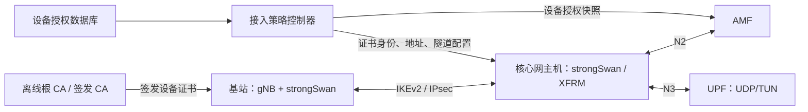
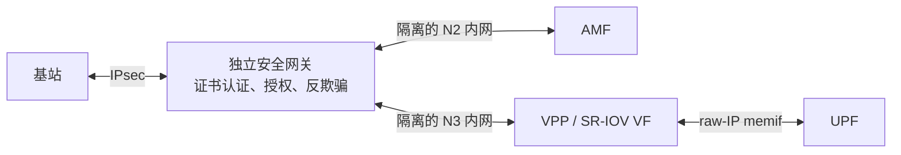

# 自有基站接入核心网的可行性方案与开发设计

版本：1.0；日期：2026-10-09；适用对象：本仓库 Open5GS 5GC、xcn Helm Chart、自研或 OAI 衍生 gNB。

本文交付范围是可行性方案、后续开发设计和备选实验操作说明，不实施核心网功能或现网部署。当前仓库尚未实现本文提出的设备授权控制器和 AMF 授权模块。文中的新增配置字段、接口和文件以“拟新增”标明，不能直接当作已有功能使用。第 8～11 节给出 Ubuntu 双机 UDP/TUN 实验方案；验证范围见第 17 节。

当前选定的首版方案是[基于 RANNodeName 的动态 HMAC 准入设计](gnb-ran-node-name-hmac-admission-design.md)：独立设备密钥、时间戳、随机数和防重放缓存，复用现有名称字段。原[固定名称方案](gnb-ran-node-name-admission-design.md)保留为比较参考。下文的证书/IPsec 方案用于进一步建立设备认证通道和 N2/N3 保护，不是首版必须实现的内容。

可行性结论：由你控制核心网执行点时，采用标准 IKEv2/IPsec 设备认证、独立设备授权及 N2/N3 防绕过措施，可以限制核心网只接受批准的设备。该证书/IPsec 方案先在网关和部署层建立保护，再给 AMF 增加小范围授权检查；VPP/memif 模式优先使用独立安全网关。客户能修改核心网程序时，本地软件方案不能提供绝对的防绕过保证。

建议先阅读第 1～7 节了解概念、架构和职责，第 16 节判断实施阶段与验收要求；第 8～15 节作为后续实验和开发的参考，不需要现在执行。完整实现需要基站密钥管理、网关策略、核心网检查和运维生命周期配合，而不是只修改 AMF 一个判断条件。

## 1. 要解决什么问题

目标是：只有公司批准的基站设备，才能向指定核心网发送 N2 信令和 N3 用户面流量，并完成业务接入。

推荐把接入条件拆成三个独立判断：

```text
身份认证通过：对方确实持有某台已登记设备的私钥。
设备授权通过：这台设备当前获准接入这个客户的这个核心网。
接入参数通过：设备上报的 PLMN、gNB ID、TAI、切片及 N3 地址符合授权。
```

三个条件全部满足才允许接入。PLMN、gNB ID、TAC、厂家名称、IP/MAC 都可以被其他实现配置或仿造，不能独立证明设备来源。UE 的 SIM/USIM 和 5G-AKA 认证解决的是用户身份问题，不能代替基站设备认证。

### 1.1 三个概念的直观解释

| 概念 | 可以理解为 | 实际作用 | 保存在哪里 |
|---|---|---|---|
| 每台基站独立证书 | 公司签发的设备身份证 | 把设备身份与公钥绑定，验证是否由可信 CA 签发 | 基站和核心网接入网关 |
| 基站私钥 | 只有设备掌握的证明能力 | 在认证过程中生成签名，证明持有证书对应的私钥 | 基站本地，产品化时放 TPM/安全芯片 |
| IPsec 接入 | 认证后建立的加密网络通道 | 保护 N2/N3 数据的机密性、完整性和防重放 | 基站系统和核心网安全网关 |
| 设备授权名单 | 当前准许进入的设备清单 | 控制客户、核心网实例、地址、标识、有效期及停用状态 | 授权数据库和各执行端的策略快照 |

证书是公开材料，别人复制证书本身不能完成认证；私钥一旦被复制，别人就可能冒充该设备。因此“独立证书”必须同时配合“独立私钥”。私钥不会通过 IKEv2 发给对端，对端验证的是认证签名。

### 1.2 能保证到什么程度

| 场景 | 方案的实际效果 | 需要的补充措施 |
|---|---|---|
| 你管理核心网，第三方基站在网络上尝试接入 | 拒绝没有授权密钥或没有设备授权的连接 | 关闭所有直接访问 N2/N3 的入口 |
| 客户复制软件基站镜像及磁盘文件 | 软件私钥可能被一起复制 | TPM/安全芯片中的不可导出设备密钥 |
| 客户在正版硬件上运行其他基站软件 | 仅验证密钥不足以区分软件来源 | 安全启动、密钥使用策略和会话绑定的远程证明 |
| 正版设备被配置成第三方基站的转发网关 | 证书认证不能单独阻止流量代转发 | 受控隧道端点、限制转发、受信软件及完整性证明 |
| 客户拥有核心网 root 或源码并修改授权逻辑 | 本地软件限制可被删除 | 由你控制的关键服务，或核心网可信启动/受保护执行环境 |

本方案把接入权绑定到授权设备密钥，并不是从标准 NGAP 报文中自动识别厂家。即使增加 TPM，也不能承诺客户完全控制软硬件时“绝对无法破解”。在线许可证也只有在关键执行点受你控制时才有效，客户可修改的本地“在线校验开关”仍可被跳过。

对于 CU/DU/RU 拆分基站，核心网通常直接接触 CU。若商业目标要求整套基站均来自本公司，还需对 CU 与 DU、DU 与 RU 的设备及软件建立相应认证关系；只检查核心网的 N2/N3 不能证明整条设备链。

## 2. IPsec 接入到底是什么

IPsec 位于 IP 网络层。应用仍然使用原来的 NGAP/SCTP、GTP-U/UDP；操作系统或网关在发送前加密，接收后校验并解密。

```text
原始 N2：内层 IP / SCTP / NGAP
原始 N3：内层 IP / UDP / GTP-U / UE 数据

封装后：外层 IP / ESP / 加密的原始 IP 报文
经 NAT 时：外层 IP / UDP 4500 / ESP / 加密的原始 IP 报文
```

IKEv2 负责协商算法、进行双向证书认证和建立安全关联；ESP 负责承载受保护的业务报文。IKE SA 是协商通道，CHILD SA 是业务通道，两者不能等同于一条 TCP 连接。证书主要参与认证，持续业务加解密使用协商产生的对称会话密钥。[IKEv2 标准 RFC 7296](https://www.rfc-editor.org/rfc/rfc7296.html)

需要放通的外层通信通常包括 UDP/500、UDP/4500，以及未使用 UDP 封装时的 ESP（IP 协议号 50）。本文实验配置强制 UDP 封装，便于跨 NAT；仍需确认路径上的 UDP/4500 可双向通信。

3GPP TS 33.501 第 9.2、9.3 节规定了 N2/N3 的 IPsec ESP 和 IKEv2 证书认证保护，可由核心网安全网关 SEG 终止隧道。本文采用这一路径；标准规定的具体证书和算法合规性应在产品认证阶段对照 TS 33.210、TS 33.310 单独核验，本文实验配置不等于完整合规认证。[TS 33.501](https://www.etsi.org/deliver/etsi_ts/133500_133599/133501/18.11.00_60/ts_133501v181100p.pdf#page=159)

## 3. 当前仓库与设计的对应关系

| 当前文件或行为 | 已有能力 | 本方案需要补充的能力 |
|---|---|---|
| [src/amf/ngap-handler.c](../src/amf/ngap-handler.c)，`ngap_handle_ng_setup_request()` | 解析 gNB 标识，检查 PLMN、TAI、切片等 | 根据可信接入地址查设备授权，检查完整 Global gNB ID |
| [src/amf/ngap-sm.c](../src/amf/ngap-sm.c)，`ngap_state_operational()` | NG Setup 成功前限制其他 NGAP 消息 | 授权失效后同样停止处理业务消息 |
| `ngap_handle_ran_configuration_update()` | 接受部分基站配置更新，包括更新 gNB ID | 更新前重做授权，避免接入后改变身份绕过检查 |
| [src/amf/context.h](../src/amf/context.h)，`amf_gnb_t` | 保存 SCTP 地址、gNB ID、PLMN、接入状态 | 保存设备身份、授权版本和到期时间 |
| [helm/xcn/templates/5gc.yaml](../helm/xcn/templates/5gc.yaml) | hostNetwork、N2/N3 Service、UDP/TUN 与 VPP/memif 部署 | 安全模式下取消 N2/N3 NodePort 暴露及配置授权快照 |
| [helm/xcn/values.yaml](../helm/xcn/values.yaml) | 配置 N2/N3 地址、UPF 模式和 VPP 网卡 | 安全接入开关及授权模块参数（拟新增） |

当前 Chart 即使启用 hostNetwork，也会创建 N2 的 NodePort 31412、N3 的 NodePort 32152。实际流量可能先经过 kube-proxy 的 DNAT，再走 INPUT 或 FORWARD。必须处理 Service、NodePort、hostPort、Pod IP、节点 IP、IPv6 和其他负载均衡入口，不能只封默认端口。

当前 `gnb_id_hash` 按数值 gNB ID 建索引。新增授权模块应比较 `PLMN + gNB ID 位数 + gNB ID 数值`，并明确当前核心网范围内标识唯一性的要求。多 PLMN 下允许相同数值 gNB ID 涉及原有索引设计，不能通过在授权层丢弃 PLMN 来规避；第一版可约束部署中的数值 ID 全局唯一，后续单独评估索引调整。

## 4. 推荐架构和可信边界

### 4.1 首版：安全网关与核心网部署在同一 Linux 主机



优点是数据面改动小，可以首先验证身份、授权及防绕过流程。强制访问条件如下：

```text
证书 SAN / IKE ID = gnb001.xcn.example
    ↓ 网关认证并选择只属于该设备的连接配置
该设备的 IPsec CHILD SA，reqid = 101
    ↓ 流量选择器与防火墙同时限制
唯一内层源地址 = 10.204.0.11/32
    ↓ AMF 以该可信源地址查授权
PLMN = 460/11，gNB ID = 0x1001，位数 = 28
```

只有当“该源地址仅能经对应受认证隧道到达 AMF”的前提成立，AMF 才能使用源地址间接映射证书身份。AMF 自己不会从普通 SCTP socket 自动获得证书，`reqid` 也不是 NGAP 消息里的设备字段。

`reqid` 是本地 IPsec 策略关联标识，不是秘密，也不是跨网关全局设备 ID。本文以每台设备、每个 CHILD 配置分配固定值，便于主机防火墙匹配。重协商期间新旧 SA 可能短时重叠，不能把 SA 数量直接当作设备数量。

### 4.2 VPP/memif：先在独立安全网关终止 IPsec



SR-IOV/VPP 收包可能绕过 Linux XFRM 和 Netfilter。此时不能把首版主机 iptables 规则当作 N3 安全措施。首选独立 SEG，SEG 后端使用专用 VLAN/VRF/交换机端口隔离；只允许 SEG 进入 N2/N3 内网，并保留每台基站独立的内层源地址，避免 SNAT 把所有设备变成同一个地址。

若 SEG 后端网络还允许第三方接入，第三方可伪造内层 IP，AMF 的地址映射就失去可信基础。后端链路应物理受控或再次受到认证加密保护。需要 VPP 本身终止 IPsec 时，应另行设计 IKE 控制面与 VPP SA/policy 同步、撤销、重协商、故障恢复及性能验收，不能只启用一条 VPP ACL 就声称完成证书认证。

## 5. 设备授权名单是什么

授权名单是一份独立于证书的业务策略。证书在有效期内仍可能对应一台已经停用、出售、退役或换客户的设备，因此“证书签名正确”不代表“当前允许接入”。

### 5.1 建议的数据结构

以下是授权控制器的输入示例，是拟新增文件格式，当前 Open5GS 不会解析它：

```yaml
schema_version: 1
policy_version: 42
generated_at: "2026-10-09T00:00:00Z"
valid_until: "2026-10-10T00:00:00Z"
core_id: "xcn-site-a"
devices:
  - device_id: "gnb001"
    ike_id: "gnb001.xcn.example"
    tenant_id: "customer-a"
    core_ids: ["xcn-site-a"]
    state: "active"
    authorization_expires_at: "2027-01-01T00:00:00Z"
    credentials:
      - issuer_id: "device-issuing-ca-2026"
        cert_sha256: "REPLACE_WITH_64_HEX_CERTIFICATE_SHA256"
        status: "active"
    n2_ipv4: "10.204.0.11"
    n3_ipv4: "10.204.0.11"
    child_reqid: 101
    max_ike_sessions: 1
    global_gnb_id:
      mcc: "460"
      mnc: "11"
      gnb_id_bits: 28
      gnb_id: "0x1001"
    allowed_tais:
      - mcc: "460"
        mnc: "11"
        tac: 1
    allowed_slices:
      - sst: 1
        sd: "010101"
```

`cert_sha256` 在证书续期时会改变，应允许受控的新旧证书重叠窗口。设备 ID 稳定；证书指纹、证书序列号和 IKE SA 唯一编号是不同概念。序列号只有在同一个签发 CA 下才有意义；指纹统一使用 DER 证书 SHA-256，禁止截断比较。

### 5.2 校验规则

- `state` 为 `active`，且授权未过期；当前 `core_id` 在 `core_ids` 中。
- 证书来自限定的签发 CA，并对应名单中的有效凭据；IKE ID 与证书 SAN 一致。
- 所有活跃设备的内层地址唯一；隧道配置禁止设备申请另一设备的地址。
- PLMN 的 MCC/MNC 按字符串及实际位数处理，`01` 与 `001` 不是同一个 MNC。
- Global gNB ID 的有效位数为 22～32，数值满足 `0 <= id < 2^bits`；TAC 为 24 位。
- Supported TA 和切片列表必须满足授权规则。首版采用“上报的每个条目都必须获准”，而不是只要其中一个条目匹配就放行。
- N3 端点，包括 PDU Session 建立、Path Switch、切换 ACK 和前传端点，必须属于对应授权设备及操作允许的地址集合。

授权名单由管理服务维护，管理员操作必须记录操作者、变更前后内容、版本和原因。基站只能读取自己的状态并提交 CSR，不能写入自己的授权。

### 5.3 首版如何把名单落实到网关

首版采用每设备一个明确连接配置，无 `%any` 设备身份兜底项：

1. 控制器读取 `active` 设备，生成 strongSwan 配置。
2. `remote.id` 固定为该设备 IKE ID；`remote.certs` 固定为批准的叶证书，限定其凭据。
3. `remote_ts` 固定为设备的 `/32` 地址，业务目标固定为本核心网 N2/N3 地址。
4. 生成对应的防火墙规则和 AMF 授权快照。
5. 禁用设备时删除允许规则、撤销 AMF 状态、卸载连接配置，并主动终止现有 SA。

strongSwan 的配置文件本身不会读取上述 YAML。名单到连接配置的转换、发布、撤销和状态对账是需要开发的控制器能力。`swanctl --load-conns` 会处理新配置及移除消失的连接配置，但不能因此假定已有 SA 已全部断开。[连接配置加载语义](https://docs.strongswan.org/docs/latest/swanctl/swanctlLoadConns.html)

## 6. 证书如何生成、保存和维护

### 6.1 推荐的 CA 层次

```text
公司离线根 CA：只给签发 CA 发证，根私钥离线保存
  └─ 设备签发 CA：给批准的 gNB 和接入网关发证
       ├─ gnb001 设备证书
       ├─ gnb002 设备证书
       └─ seg01 网关证书
```

生产环境可进一步将网关和基站分到不同签发 CA，减少跨角色误授权。本文实验共用一个签发 CA，通过固定身份和批准的叶证书区分角色。

| 材料 | 是否保密 | 分发范围 | 推荐保存方式 |
|---|---|---|---|
| 根 CA 私钥 | 是，最高级别 | 仅离线签发端 | 离线加密备份或 HSM，多人恢复流程 |
| 签发 CA 私钥 | 是 | 仅签发服务 | HSM/受保护密钥服务；实验可加密 PEM |
| 根 CA、签发 CA 证书 | 否，但不能任意替换 | 基站、SEG、管理服务 | 经可信安装/更新渠道分发 |
| 基站私钥 | 是 | 只在该基站 | 实验为 root 可读文件，产品化为硬件密钥 |
| 网关私钥 | 是 | 只在对应网关 | 受保护文件或 HSM/TPM |
| 设备证书和 CSR | 否 | 签发端、设备、网关 | 与设备台账关联；CSR 不含私钥 |
| CRL | 否，必须校验签名和时效 | 全部认证端 | 自动更新并监控过期 |

CA 私钥不得打进镜像、放进 Git 或部署到基站。Kubernetes Secret 的 base64 编码不是加密；即便启用静态加密和 RBAC，它也不能代替 TPM 的不可导出属性。

### 6.2 首次发证流程

1. 出厂台账创建稳定的 `device_id`，登记硬件序列号、型号和客户。
2. 设备在本地生成独立私钥和 CSR；只上传 CSR。
3. 签发服务验证出厂身份或一次性注册凭据，检查 CSR 自签名，确认申请公钥。
4. 服务端从台账构造证书 Subject/SAN，忽略未经审核的 CSR 扩展；签发设备叶证书。
5. 设备安装叶证书和 CA 公共证书，验证公钥与私钥一致。
6. 授权服务将证书指纹与设备绑定，并设置核心网、地址、gNB ID 和状态。
7. 控制器发布网关、防火墙和 AMF 策略，全部就绪后设备才开始 NG Setup。

CSR 自签名只能证明申请者持有对应私钥，不能证明它是自家生产的基站。第一次注册必须依靠受控产线、一机一密的引导凭据或制造身份根。设备自行填写的序列号不能作为发证依据。

### 6.3 周期建议

以下是初始产品策略建议，不是标准强制值：根 CA 10 年、签发 CA 5 年、设备证书 90 天、网关证书 1 年；签发时叶证书到期时间不得超过签发 CA。设备提前 30 天申请续期，新旧凭据最多重叠 7 天。

授权政策建议以带版本的快照分发，默认最长 24 小时有效；站点离线超过有效期则停止新接入，并在明确的截止时间处理已有连接。确有长期离线需求时，使用另行签发的离线授权包及本地 CRL，写明离线有效期和不能实时撤销的限制。

证书过期、CRL 过期、授权快照过期是三种不同的时限，必须分别监控。所有认证端和签发端保持可靠时间同步；不能通过把系统时间调回过去来延续授权。

## 7. 开发分工和交付物

| 模块 | 责任 | 首版交付物 |
|---|---|---|
| 产线/设备注册 | 首次身份核验、硬件台账、CSR 申请 | 一机一密的注册流程和设备台账 |
| PKI 服务 | 签发、续期、吊销、CA 轮换 | CA 策略、审计记录、CRL 发布 |
| 接入策略控制器 | 名单转策略、原子发布、终止 SA、重启对账 | 每设备连接配置、规则和版本状态 |
| 基站接入代理 | 密钥管理、IKE 发起、隧道健康、启动次序 | strongSwan 集成和设备更新逻辑 |
| AMF 授权模块 | NGAP 入口和配置更新校验 | 设备身份状态、失败处理、到期撤销 |
| N3 执行层 | 设备地址隔离、端点校验、数据面撤销 | Linux 规则或 SEG/VPP 等价策略 |
| 运维工具 | 台账管理、证书告警、故障诊断 | 查询、启停、续期和审计界面 |

先用文件台账和受控发布工具即可验证方案；生产控制器再引入数据库和管理 API。无需第一步修改 NGAP 编码或设计自定义密码协议。

## 8. Ubuntu 双机实验：地址和前提

实验以 Ubuntu 22.04 的 OpenSSL 3.0、strongSwan 5.9.x 和现有 xcn UDP/TUN 模式为基线。命令标注执行位置；配置需替换为实际环境。下面的两台主机是示例规划，不代表当前部署实际地址。

| 项目 | 核心网主机/SEG | 基站主机 |
|---|---|---|
| 外层地址 | `10.2.0.119` | `10.2.0.120` |
| AMF 内层地址 | `10.203.0.1/32`，配置在 lo | — |
| UPF N3 内层地址 | `10.203.0.2/32`，配置在 lo | — |
| gNB N2/N3 内层地址 | — | `10.204.0.11/32`，配置在 lo |
| 认证身份 | `seg01.xcn.example` | `gnb001.xcn.example` |
| CHILD 配置名 | `gnb001-data` | `gnb001-data` |
| 本地固定 reqid | `101` | `101` |

必须满足：

- 两台主机外层地址互通，地址网段与 UE 网段、Pod/Service CIDR 无冲突。
- 两端私钥各自独立，信任的 CA 由可信渠道安装。
- 核心网主机和 gNB 不共享同一个网络命名空间；同机实验需使用独立 VM/容器网络空间，否则本地流量不代表远程 IPsec 路径。
- hostNetwork 的核心网 Pod 固定到配置了内层地址、运行 SEG 并安装防火墙的节点。
- 本实验关闭 gNB 的 SCTP 多宿主/MOBIKE，固定一个 N2/N3 源地址；生产支持多宿主时，每个地址都要绑定授权，不能迁移到未保护路径。
- 安全模式先移除 N2/N3 的 NodePort Service，再对主机端口实施保护；第 11 节解释当前 Chart 的限制。
- 预先保留独立管理通道，使用专用实验节点执行网络命令。

若系统为了外网访问配置了 TCP 代理，应检查它是否影响证书服务、包下载和路由；普通 TCP 代理不能直接承载 IKE/ESP/UDP4500。本文不需要修改现有代理脚本。

### 8.1 两端安装依赖

在两台实验主机执行；CA 主机只需 OpenSSL 等签发工具，不需要运行 IPsec：

```bash
sudo apt-get update
sudo apt-get install -y openssl charon-systemd strongswan-swanctl \
  libstrongswan-standard-plugins libcharon-extra-plugins \
  iproute2 iptables tcpdump
```

Ubuntu 包版本和可用插件以实际发行版为准。确认 `openssl`、X.509、CRL、`revocation`、`kernel-netlink`、`socket-default`、`vici` 等插件已加载；不要同时启动 legacy strongswan-starter 和 charon-systemd 两个 IKE 守护进程。[charon-systemd 说明](https://docs.strongswan.org/docs/latest/daemons/charon-systemd.html)

## 9. 可复现的证书生成实验

以下用临时目录展示完整 CA 状态，避免覆盖已有 CA。生产把状态迁移到受保护持久目录或专用 CA 服务。示例 CA 私钥采用交互口令加密，设备/网关软件私钥未加密，依靠文件权限供守护进程使用；这只适用于首版软件密钥方案。

### 9.1 在 CA 主机初始化根 CA 和签发 CA 状态

在同一个 Bash 会话中按顺序执行：

```bash
set -euo pipefail
umask 077
PKI_LAB_DIR="$(mktemp -d /tmp/xcn-gnb-pki.XXXXXX)"
cd "$PKI_LAB_DIR"
for ca in root issuer; do
  mkdir -p "$ca"/{private,certs,csr,newcerts,crl}
  : > "$ca/index.txt"
  openssl rand -hex 16 > "$ca/serial"
  printf '%s\n' 1000 > "$ca/crlnumber"
done
cat > root/openssl.cnf <<'EOF'
[ca]
default_ca = root_ca
[root_ca]
dir = ./root
database = $dir/index.txt
new_certs_dir = $dir/newcerts
certificate = $dir/certs/root-ca.cert.pem
private_key = $dir/private/root-ca.key.pem
serial = $dir/serial
crlnumber = $dir/crlnumber
default_md = sha384
default_days = 1825
default_crl_days = 180
policy = subject_policy
unique_subject = no
copy_extensions = none
crl_extensions = crl_ext
[subject_policy]
countryName = optional
organizationName = supplied
commonName = supplied
[root_cert]
basicConstraints = critical,CA:TRUE,pathlen:1
keyUsage = critical,keyCertSign,cRLSign
subjectKeyIdentifier = hash
authorityKeyIdentifier = keyid:always
[issuing_ca]
basicConstraints = critical,CA:TRUE,pathlen:0
keyUsage = critical,keyCertSign,cRLSign
subjectKeyIdentifier = hash
authorityKeyIdentifier = keyid:always,issuer
[crl_ext]
authorityKeyIdentifier = keyid:always
EOF
cat > issuer/openssl.cnf <<'EOF'
[ca]
default_ca = issuing_ca
[issuing_ca]
dir = ./issuer
database = $dir/index.txt
new_certs_dir = $dir/newcerts
certificate = $dir/certs/issuing-ca.cert.pem
private_key = $dir/private/issuing-ca.key.pem
serial = $dir/serial
crlnumber = $dir/crlnumber
default_md = sha256
default_days = 90
default_crl_days = 1
policy = subject_policy
unique_subject = no
copy_extensions = none
crl_extensions = crl_ext
[subject_policy]
countryName = optional
organizationName = supplied
commonName = supplied
[crl_ext]
authorityKeyIdentifier = keyid:always
EOF
```

`copy_extensions = none` 表示签发时不盲目接受申请者提供的 CA 权限、SAN 等扩展。生产签发服务还需明确覆盖 Subject/SAN，而不是把 CSR 的 CN 直接当作已核验身份。

### 9.2 创建离线根和签发 CA

在 CA 主机执行；遇到口令提示时输入并安全记录 CA 私钥口令：

```bash
openssl genpkey -algorithm EC -pkeyopt ec_paramgen_curve:secp384r1 \
  -aes-256-cbc -out root/private/root-ca.key.pem
openssl req -new -x509 -sha384 -days 3650 \
  -key root/private/root-ca.key.pem \
  -subj '/O=XCN/CN=XCN Offline Root CA 2026' \
  -config root/openssl.cnf -extensions root_cert \
  -out root/certs/root-ca.cert.pem
openssl genpkey -algorithm EC -pkeyopt ec_paramgen_curve:prime256v1 \
  -aes-256-cbc -out issuer/private/issuing-ca.key.pem
openssl req -new -sha256 -key issuer/private/issuing-ca.key.pem \
  -subj '/O=XCN/CN=XCN Device Issuing CA 2026' \
  -out issuer/csr/issuing-ca.csr.pem
openssl ca -batch -notext -config root/openssl.cnf \
  -extensions issuing_ca -days 1825 \
  -in issuer/csr/issuing-ca.csr.pem \
  -out issuer/certs/issuing-ca.cert.pem
openssl verify -CAfile root/certs/root-ca.cert.pem \
  issuer/certs/issuing-ca.cert.pem
```

生产中的根和签发 CA 分离到不同主机或密钥设备。`openssl ca` 是用于说明流程的简单 CA 工具，维护签发数据库但不提供并发锁；对同一 CA 的签发、吊销和 CRL 操作必须串行。产品服务使用事务数据库或串行作业队列，不能并发直接修改这些状态文件。[OpenSSL CA 文档](https://docs.openssl.org/3.0/man1/openssl-ca/)

### 9.3 在基站本地生成私钥和 CSR

在 gNB 主机执行；每台设备都重新生成私钥：

```bash
umask 077
GNB_CRED_DIR="$(mktemp -d /tmp/xcn-gnb001-creds.XXXXXX)"
openssl genpkey -algorithm EC -pkeyopt ec_paramgen_curve:prime256v1 \
  -out "$GNB_CRED_DIR/gnb001.key.pem"
openssl req -new -sha256 -key "$GNB_CRED_DIR/gnb001.key.pem" \
  -subj '/O=XCN/CN=gnb001' \
  -out "$GNB_CRED_DIR/gnb001.csr.pem"
openssl req -in "$GNB_CRED_DIR/gnb001.csr.pem" -noout -verify
```

只通过经过认证的管理通道把 `gnb001.csr.pem` 交给 CA。CA 将它放在 `$PKI_LAB_DIR/issuer/csr/gnb001.csr.pem`。不要复制 `gnb001.key.pem` 到 CA，也不要从一台基站复制私钥到另一台。

### 9.4 CA 签发基站证书

CA 管理员核验设备台账后，在 CA 主机执行：

```bash
cd "$PKI_LAB_DIR"
cat > issuer/gnb001.ext.cnf <<'EOF'
[device_leaf]
basicConstraints = critical,CA:FALSE
keyUsage = critical,digitalSignature
extendedKeyUsage = 1.3.6.1.5.5.7.3.17
subjectKeyIdentifier = hash
authorityKeyIdentifier = keyid:always,issuer
subjectAltName = DNS:gnb001.xcn.example
EOF
openssl ca -batch -notext -config issuer/openssl.cnf \
  -subj '/O=XCN/CN=gnb001' \
  -extfile issuer/gnb001.ext.cnf -extensions device_leaf -days 90 \
  -in issuer/csr/gnb001.csr.pem \
  -out issuer/certs/gnb001.cert.pem
openssl verify -CAfile root/certs/root-ca.cert.pem \
  -untrusted issuer/certs/issuing-ca.cert.pem issuer/certs/gnb001.cert.pem
openssl x509 -in issuer/certs/gnb001.cert.pem -noout \
  -serial -subject -issuer -dates -ext subjectAltName
openssl x509 -in issuer/certs/gnb001.cert.pem -outform DER | openssl dgst -sha256
```

示例 SAN 是 DNS 类型的 IKE 身份，连接使用明确外层 IP，因此不要求解析 `gnb001.xcn.example`。EKU 的 OID `1.3.6.1.5.5.7.3.17` 是 `id-kp-ipsecIKE`；具体互操作证书策略需验证双方实现。[IKE 证书使用 RFC 4945](https://www.rfc-editor.org/rfc/rfc4945.html)，[OpenSSL 证书扩展格式](https://docs.openssl.org/3.0/man5/x509v3_config/)

证书返回基站后，将它保存到 `$GNB_CRED_DIR/gnb001.cert.pem`，核验安装证书与本机私钥匹配：

```bash
openssl pkey -in "$GNB_CRED_DIR/gnb001.key.pem" -pubout -outform DER | openssl dgst -sha256
openssl x509 -in "$GNB_CRED_DIR/gnb001.cert.pem" -pubkey -noout | \
  openssl pkey -pubin -outform DER | openssl dgst -sha256
```

两行公钥摘要应相同。认证者仍须用真实握手签名验证持钥，比较摘要只是安装检查。

### 9.5 网关生成 CSR，CA 签发网关证书

在 SEG 主机生成它自己的密钥：

```bash
umask 077
SEG_CRED_DIR="$(mktemp -d /tmp/xcn-seg01-creds.XXXXXX)"
openssl genpkey -algorithm EC -pkeyopt ec_paramgen_curve:prime256v1 \
  -out "$SEG_CRED_DIR/seg01.key.pem"
openssl req -new -sha256 -key "$SEG_CRED_DIR/seg01.key.pem" \
  -subj '/O=XCN/CN=seg01' -out "$SEG_CRED_DIR/seg01.csr.pem"
```

只将网关 CSR 传给 CA，并保存为 `issuer/csr/seg01.csr.pem`。在 CA 主机执行：

```bash
cd "$PKI_LAB_DIR"
cat > issuer/seg01.ext.cnf <<'EOF'
[gateway_leaf]
basicConstraints = critical,CA:FALSE
keyUsage = critical,digitalSignature
extendedKeyUsage = 1.3.6.1.5.5.7.3.17
subjectKeyIdentifier = hash
authorityKeyIdentifier = keyid:always,issuer
subjectAltName = DNS:seg01.xcn.example
EOF
openssl ca -batch -notext -config issuer/openssl.cnf \
  -subj '/O=XCN/CN=seg01' \
  -extfile issuer/seg01.ext.cnf -extensions gateway_leaf -days 365 \
  -in issuer/csr/seg01.csr.pem -out issuer/certs/seg01.cert.pem
openssl ca -config root/openssl.cnf -gencrl -out root/crl/root-ca.crl.pem
openssl ca -config issuer/openssl.cnf -gencrl -out issuer/crl/issuing-ca.crl.pem
cat root/certs/root-ca.cert.pem issuer/certs/issuing-ca.cert.pem \
  root/crl/root-ca.crl.pem issuer/crl/issuing-ca.crl.pem > trust-with-crls.pem
openssl verify -CAfile trust-with-crls.pem -crl_check_all \
  issuer/certs/gnb001.cert.pem issuer/certs/seg01.cert.pem
```

启用严格吊销校验时，既需要签发 CA 的 CRL 检查叶证书，也需要根 CA 的 CRL 检查签发 CA。即使当前没有吊销证书，也应提供有效空 CRL。`openssl verify` 的静态检查不能替代真正的 IKE 握手。

### 9.6 将公共材料和本机私钥安装到 strongSwan

将根证书、签发 CA 证书和两份 CRL 经可信管理通道分别送到两台主机。示例在接收端集中到 `$CERT_BUNDLE_DIR`：

```text
root-ca.cert.pem
issuing-ca.cert.pem
root-ca.crl.pem
issuing-ca.crl.pem
gnb001.cert.pem
seg01.cert.pem
```

两端分别执行，`CERT_BUNDLE_DIR` 是操作者指定的接收目录：

```bash
CERT_BUNDLE_DIR=/srv/xcn-credentials/incoming
sudo install -d -m 0755 /etc/swanctl/x509 /etc/swanctl/x509ca /etc/swanctl/x509crl
sudo install -d -m 0700 /etc/swanctl/private
sudo install -m 0644 "$CERT_BUNDLE_DIR/root-ca.cert.pem" /etc/swanctl/x509ca/
sudo install -m 0644 "$CERT_BUNDLE_DIR/issuing-ca.cert.pem" /etc/swanctl/x509ca/
sudo install -m 0644 "$CERT_BUNDLE_DIR/root-ca.crl.pem" /etc/swanctl/x509crl/
sudo install -m 0644 "$CERT_BUNDLE_DIR/issuing-ca.crl.pem" /etc/swanctl/x509crl/
sudo install -m 0644 "$CERT_BUNDLE_DIR/gnb001.cert.pem" /etc/swanctl/x509/
sudo install -m 0644 "$CERT_BUNDLE_DIR/seg01.cert.pem" /etc/swanctl/x509/
```

仅在 gNB 上安装它自己的私钥：

```bash
sudo install -m 0600 "$GNB_CRED_DIR/gnb001.key.pem" /etc/swanctl/private/
```

仅在 SEG 上安装它自己的私钥：

```bash
sudo install -m 0600 "$SEG_CRED_DIR/seg01.key.pem" /etc/swanctl/private/
```

对端叶证书在这里用于固定批准凭据；它是公开材料。续期时控制器要同步更新这些批准凭据，不能只在基站替换证书。

## 10. strongSwan 实验配置

本节配置根据每设备授权生成，一台设备一个连接；生产不由人工复制修改大批配置。保留管理员已有配置，仅向 `/etc/swanctl/conf.d/` 添加专用文件，确认主文件包含 `include conf.d/*.conf`，避免同名连接被其他文件覆盖。

### 10.1 内层地址及路由

在 SEG 主机执行：

```bash
sudo ip address add 10.203.0.1/32 dev lo
sudo ip address add 10.203.0.2/32 dev lo
ip route get 10.2.0.120
ip route get 10.204.0.11 from 10.203.0.1
```

在 gNB 主机执行：

```bash
sudo ip address add 10.204.0.11/32 dev lo
ip route get 10.2.0.119
ip route get 10.203.0.1 from 10.204.0.11
ip route get 10.203.0.2 from 10.204.0.11
```

地址已经存在时不用重复添加。需要正常的外层可达路由；内层远端经 XFRM 策略进入隧道，strongSwan 可能在路由表 220 安装辅助路由，应同时检查 `ip rule` 和该表。若没有默认路由，按实际外层接口和下一跳给远端内层地址补充路由；不要把 loopback 的 `/32` 地址误当成同一二层网段。

本例是两个本地主机端点，不需要全局开启 IPv4 forwarding。独立 SEG 转发到另一台核心网时，才需要开启转发、配置双向路由并在 FORWARD 路径实施同等保护。生产将内层地址持久化到 netplan/systemd-networkd 等节点配置，并在 Pod 调度前确认接口与路由就绪。

### 10.2 SEG 配置：`/etc/swanctl/conf.d/gnb001.conf`

```conf
connections {
    gnb001 {
        version = 2
        local_addrs = 10.2.0.119
        remote_addrs = 10.2.0.120
        proposals = aes256gcm16-prfsha256-ecp256
        mobike = no
        encap = yes
        unique = replace
        reauth_time = 1h
        dpd_delay = 30s
        local {
            auth = pubkey
            id = seg01.xcn.example
            certs = seg01.cert.pem
        }
        remote {
            auth = pubkey
            id = gnb001.xcn.example
            certs = gnb001.cert.pem
            cacerts = issuing-ca.cert.pem
            revocation = strict
        }
        children {
            gnb001-data {
                mode = tunnel
                local_ts = 10.203.0.1/32, 10.203.0.2/32
                remote_ts = 10.204.0.11/32
                esp_proposals = aes256gcm16-ecp256
                reqid = 101
                rekey_time = 30m
                start_action = none
                dpd_action = clear
            }
        }
    }
}
```

`remote_addrs` 可在动态外层地址产品中改为 `%any`，但 `remote.id` 和批准的证书必须保持设备级限制，内层地址仍固定且唯一。实验固定外层地址以减少变量。

### 10.3 gNB 配置：`/etc/swanctl/conf.d/xcn.conf`

```conf
connections {
    xcn {
        version = 2
        local_addrs = 10.2.0.120
        remote_addrs = 10.2.0.119
        proposals = aes256gcm16-prfsha256-ecp256
        mobike = no
        encap = yes
        unique = replace
        reauth_time = 1h
        dpd_delay = 30s
        local {
            auth = pubkey
            id = gnb001.xcn.example
            certs = gnb001.cert.pem
        }
        remote {
            auth = pubkey
            id = seg01.xcn.example
            certs = seg01.cert.pem
            cacerts = issuing-ca.cert.pem
            revocation = strict
        }
        children {
            gnb001-data {
                mode = tunnel
                local_ts = 10.204.0.11/32
                remote_ts = 10.203.0.1/32, 10.203.0.2/32
                esp_proposals = aes256gcm16-ecp256
                reqid = 101
                rekey_time = 30m
                start_action = none
                dpd_action = restart
            }
        }
    }
}
```

两个方向的 traffic selector 镜像对应。本实验加密两组内层地址之间的全部 IP 流量，再由防火墙仅放行业务端口，便于用源地址明确的 ping 检查隧道。生产可按协议/端口进一步收窄选择器。

上述算法为实验选型，需检查实际插件和内核支持。密钥重协商不等于重新认证；普通 IKE/CHILD rekey 不保证重新检查证书和授权，因此另设 reauthentication，并对紧急停用主动断开。[SA 更新说明](https://docs.strongswan.org/docs/latest/config/rekeying.html)

### 10.4 启动和检查

两端先安装第 11 节的保护规则，再执行：

```bash
sudo systemctl enable --now strongswan
sudo swanctl --load-all
sudo swanctl --list-certs
sudo swanctl --list-conns
```

仅在 gNB 执行手动建立隧道：

```bash
sudo swanctl --initiate --child gnb001-data
sudo swanctl --list-sas
ping -I 10.204.0.11 -c 3 10.203.0.1
```

两端核验：

```bash
sudo ip -s xfrm policy
sudo swanctl --list-sas
sudo journalctl -u strongswan --since '-10 min' --no-pager
ip rule show
ip route show table 220
```

预期看到正确的对端 ID、已建立的 IKE SA 和 CHILD SA，以及收发计数增长。`ip xfrm state` 在某些输出格式中会显示会话密钥，排障时不要把未脱敏的完整输出粘贴到工单、聊天或日志平台。

产品化时由接入代理在启动后主动建立 CHILD SA，检测隧道和授权就绪后再启动或放行 gNB。隧道消失时停止 N2/N3 业务，不能切换为直连。手动的 `start_action = none` 是为了让实验启动顺序可控，不能当作无人值守自动启动配置。

## 11. Linux 防绕过与 Helm/gNB 配置

### 11.1 防火墙应验证实际 IPsec 路径

源 IP 匹配不足以证明认证。SEG 的 INPUT 规则要同时匹配设备内层源地址、核心网内层目标地址、协议/端口，以及接收路径上的 IPsec policy/reqid；OUTPUT 同样禁止隧道消失后明文回退。

以下是单设备、同主机 SEG、IPv4 UDP/TUN 的实验防护。它只新增专用链，不清空现有防火墙。先创建完整链，再把入口插在 INPUT/OUTPUT 前端；不为既有连接优先设置绕过授权的 `ESTABLISHED` 放行项。

在 SEG 实验主机执行一次：

```bash
sudo iptables -N XCN_GNB_IN
sudo iptables -N XCN_GNB_OUT
sudo iptables -A XCN_GNB_IN -s 10.204.0.11/32 -d 10.203.0.1/32 \
  -p sctp --dport 38412 -m policy --dir in --pol ipsec \
  --proto esp --mode tunnel --reqid 101 -j ACCEPT
sudo iptables -A XCN_GNB_IN -s 10.204.0.11/32 -d 10.203.0.2/32 \
  -p udp --dport 2152 -m policy --dir in --pol ipsec \
  --proto esp --mode tunnel --reqid 101 -j ACCEPT
sudo iptables -A XCN_GNB_IN -s 10.204.0.11/32 -d 10.203.0.1/32 \
  -p icmp -m policy --dir in --pol ipsec \
  --proto esp --mode tunnel --reqid 101 -j ACCEPT
sudo iptables -A XCN_GNB_IN -p sctp --dport 38412 -j DROP
sudo iptables -A XCN_GNB_IN -d 10.203.0.2/32 -p udp --dport 2152 -j DROP
sudo iptables -A XCN_GNB_IN -d 10.203.0.1/32 -p icmp -j DROP
sudo iptables -A XCN_GNB_IN -j RETURN
sudo iptables -A XCN_GNB_OUT -s 10.203.0.1/32 -d 10.204.0.11/32 \
  -p sctp --sport 38412 -m policy --dir out --pol ipsec \
  --proto esp --mode tunnel --reqid 101 -j ACCEPT
sudo iptables -A XCN_GNB_OUT -s 10.203.0.2/32 -d 10.204.0.11/32 \
  -p udp --sport 2152 --dport 2152 -m policy --dir out --pol ipsec \
  --proto esp --mode tunnel --reqid 101 -j ACCEPT
sudo iptables -A XCN_GNB_OUT -s 10.203.0.1/32 -d 10.204.0.11/32 \
  -p icmp -m policy --dir out --pol ipsec \
  --proto esp --mode tunnel --reqid 101 -j ACCEPT
sudo iptables -A XCN_GNB_OUT -s 10.203.0.1/32 -p sctp --sport 38412 -j DROP
sudo iptables -A XCN_GNB_OUT -s 10.203.0.2/32 -p udp --sport 2152 -j DROP
sudo iptables -A XCN_GNB_OUT -s 10.203.0.1/32 -p icmp -j DROP
sudo iptables -A XCN_GNB_OUT -j RETURN
sudo iptables -I INPUT 1 -j XCN_GNB_IN
sudo iptables -I OUTPUT 1 -j XCN_GNB_OUT
```

ICMP 放行只用于本实验的受保护内层地址连通检查，生产可收窄到所需错误消息。UDP/2152 的丢弃限定 UPF 专用地址，避免误伤当前 SMF 的 `127.0.0.4:2152` 内部路径。

该 N3 实验两端的 GTP-U socket 均绑定 UDP/2152，下行目标也是 gNB 的 UDP/2152。测试时应按实际 N3 端口收发，不能把向随机源端口回复的普通 UDP echo 当作这一规则下的 GTP-U 下行。若产品允许不同的端口，需在授权数据和对应规则中明确配置。

基站也要安装出入站保护，避免隧道消失后泄露 N2/N3：

```bash
sudo iptables -N XCN_CORE_IN
sudo iptables -N XCN_CORE_OUT
sudo iptables -A XCN_CORE_OUT -s 10.204.0.11/32 -d 10.203.0.1/32 \
  -m policy --dir out --pol ipsec --proto esp --mode tunnel --reqid 101 -j ACCEPT
sudo iptables -A XCN_CORE_OUT -s 10.204.0.11/32 -d 10.203.0.2/32 \
  -m policy --dir out --pol ipsec --proto esp --mode tunnel --reqid 101 -j ACCEPT
sudo iptables -A XCN_CORE_OUT -d 10.203.0.1/32 -j DROP
sudo iptables -A XCN_CORE_OUT -d 10.203.0.2/32 -j DROP
sudo iptables -A XCN_CORE_OUT -j RETURN
sudo iptables -A XCN_CORE_IN -s 10.203.0.1/32 -d 10.204.0.11/32 \
  -m policy --dir in --pol ipsec --proto esp --mode tunnel --reqid 101 -j ACCEPT
sudo iptables -A XCN_CORE_IN -s 10.203.0.2/32 -d 10.204.0.11/32 \
  -m policy --dir in --pol ipsec --proto esp --mode tunnel --reqid 101 -j ACCEPT
sudo iptables -A XCN_CORE_IN -d 10.204.0.11/32 -j DROP
sudo iptables -A XCN_CORE_IN -j RETURN
sudo iptables -I INPUT 1 -j XCN_CORE_IN
sudo iptables -I OUTPUT 1 -j XCN_CORE_OUT
```

还需在已有外层防火墙中允许双方 UDP/500 和 UDP/4500，并按节点现有规则维护管理与 Kubernetes 流量。XFRM 保护的业务报文必须在 SNAT/MASQUERADE 前豁免 NAT，否则源地址改变后可能不再匹配策略；只豁免本方案内层地址，不扩大到所有业务。[IPsec 与 NAT 的关系](https://docs.strongswan.org/docs/latest/howtos/forwarding.html)

```bash
sudo iptables -t nat -I POSTROUTING 1 -s 10.204.0.11/32 -d 10.203.0.0/30 \
  -m policy --dir out --pol ipsec -j ACCEPT
```

上述 NAT 豁免在 gNB 侧执行；SEG 上对应方向使用 `-s 10.203.0.0/30 -d 10.204.0.11/32`。检查内层网段是否有其他 SNAT、Service DNAT 或 kube-proxy 改写，不能依赖源地址已经改变的链来恢复身份。

生产规则应由控制器事务化发布，并具有重复执行、版本回滚和持久化能力。上述一次性命令重复执行会产生同名链冲突或重复规则，不能直接拿来做启动脚本。

### 11.2 当前 Chart 的实验部署配置

先完成内层地址和防火墙。以仓库根目录为当前目录，渲染而不部署：

```bash
helm template xcn helm/xcn -n xcn \
  --set fivegc.hostNetwork.enabled=true \
  --set networking.amf.ngap.serverAddress=10.203.0.1 \
  --set networking.upf.mode=tun \
  --set networking.upf.n3.address=10.203.0.2 \
  > /tmp/xcn-ipsec-lab.rendered.yaml
```

此命令只说明已有 Chart 如何绑定内层地址，渲染结果仍包含 N2/N3 NodePort，尚不是完成防绕过的生产配置。实验可使用以下离线过滤，去掉仅用于 N2/N3 对外接入的两个 Service，保留其他资源：

```bash
python3 - <<'PY'
import pathlib
import yaml

source = pathlib.Path('/tmp/xcn-ipsec-lab.rendered.yaml')
target = pathlib.Path('/tmp/xcn-ipsec-lab.private.yaml')
objects = [item for item in yaml.safe_load_all(source.read_text()) if item]
excluded = {'xcn-amf-ngap', 'xcn-upf-n3'}
result = [item for item in objects if not (
    item.get('kind') == 'Service' and
    item.get('metadata', {}).get('name') in excluded
)]
target.write_text(yaml.safe_dump_all(result, sort_keys=False))
print(f'{len(objects) - len(result)} N2/N3 services removed; output: {target}')
PY
```

此脚本需要 `python3-yaml`，只适用于这里固定的 release 名称 `xcn`。用独立实验命名空间/节点确认结果后再应用，且不要与现有 Helm release 混合管理。

开发阶段应在 Chart 中增加真正的安全模式开关，条件性取消两个 Service 的创建，并校验 hostPort、IPv6、LoadBalancer 及 Pod 网络访问路径。拟新增值如下，当前版本不支持：

```yaml
security:
  gnbAdmission:
    enabled: true
    coreId: "xcn-site-a"
    policyConfigMap: "xcn-gnb-admission-policy"
    exposeDirectN2N3: false
```

`hostNetwork=true` 时，不能把普通 NetworkPolicy 作为唯一隔离措施，实际支持取决于 CNI。IPsec 同主机模式的强制点是节点 XFRM、防火墙和受限监听地址；独立 SEG 模式的强制点还包括 SEG 后端路由、VLAN/VRF 与访问控制。

### 11.3 gNB 必须绑定内层地址

gNB 的 AMF 目标设置为 `10.203.0.1`，N2 本地源和 N3 监听/通告地址均为 `10.204.0.11`。只改 AMF IP 而保留外层 N3 地址会导致信令通、业务不通，或让下行走到未授权地址。

本机相邻 OAI 仓库的 Chart 已支持 `network.n2Address`、`network.n3Address`，会生成 `GNB_IPV4_ADDRESS_FOR_NG_AMF`、`GNB_IPV4_ADDRESS_FOR_NGU`。可用下面命令只渲染配置，后续实施时再检查节点、网络命名空间及实际镜像版本：

```bash
helm template gnb /home/xiazhangtao/code/openairinterface5g/charts/oai-gnb \
  -n gnb-ipsec-lab \
  --set hostNetwork=true \
  --set service.enabled=false \
  --set amf.ip=10.203.0.1 \
  --set network.n2Address=10.204.0.11 \
  --set network.n3Address=10.204.0.11 \
  --set-string config.gnbId=0x1001 \
  --set-string plmn.mcc=460 \
  --set-string plmn.mnc=11 \
  --set-string plmn.sd=0x010101 \
  > /tmp/oai-gnb-ipsec-lab.rendered.yaml
```

核心网 Chart 当前内置 PLMN `460/11`、TAC `1`、SST `1`、SD `010101`，本文授权示例与之保持一致。相邻 OAI 源码 `MACRO_GNB_ID_TO_BIT_STRING` 使用 4 字节、4 个 unused bits，即 28 位，所以示例为 `gnb_id_bits: 28`；其他自研实现应以实际发送位数为准。不同版本的配置名可能改变，不能假定只设置 `amf.ip` 就同时修改两个源地址。

同时匹配授权中的 PLMN、gNB ID 位数和值、TAC 和 S-NSSAI。SD 按字符串配置以保留前导零。保护 NGAP 的证书校验不会改变 UE 的 SIM 配置或 5G-AKA 密钥。

### 11.4 MTU、路由与接口检查

IPsec、UDP 封装、GTP-U 会叠加额外开销，不能统一断言“MTU 1400 就一定够用”。按外层 IPv4/IPv6、算法、ESP 对齐、UDP4500、GTP 扩展头和实际链路 MTU 计算内层预算，并允许必要的 ICMP Fragmentation Needed/Packet Too Big。

先验证小包，再验证带 DF 的递增报文、SCTP 分片和真实 UE 的 UDP/TCP 业务。TCP MSS 调整不能解决 SCTP/GTP-U 的全部 MTU 问题。确认两端接口 link-up，N3 下行回程经过正确网关；多队列、QoS 重排和 ESP anti-replay 窗口应在吞吐验收中专门测试。

## 12. AMF 和控制器的开发设计

### 12.1 最小实现范围与拟修改文件

本次仅交付本文和 README 链接。下表是后续实施时的建议修改范围，尚未开发：

| 拟修改/新增位置 | 最小职责 |
|---|---|
| `src/amf/gnb-admission.[ch]`（拟新增） | 策略解析、查询、参数比较、到期处理 |
| `src/amf/context.[ch]` | 保存授权字段、解析配置路径、启动时载入策略 |
| `src/amf/ngap-handler.c` | NG Setup、RAN Configuration Update、切换端点相关校验 |
| `src/amf/ngap-sm.c` | 非授权状态的消息门禁和撤销事件 |
| `src/amf/meson.build` | 编译新增小模块 |
| `configs/open5gs/amf.yaml.in` | 示例授权配置（拟新增） |
| `helm/xcn/values.yaml`、`templates/config.yaml`、`templates/5gc.yaml` | 安全开关、授权文件挂载、取消直连暴露 |
| `src/smf/ngap-handler.c` 等实际 N2 Transfer 解析入口 | 校验 N3 端点及前传地址，必要时传递可信设备上下文 |
| 独立接入策略控制器（拟新增） | 将管理策略发布到 strongSwan、防火墙和 AMF |
| `tests/5gc` / `tests/handover` 的合适测试入口 | 非授权、身份变更、撤销、切换端点测试 |

控制器可先作为节点 systemd 服务运行，以免 Pod 生命周期与节点的 IPsec 状态耦合。受控 VICI Unix socket 仅对控制器开放，不对业务网络公开。VICI 是控制接口，不是附带强认证的远程管理服务。[VICI 插件说明](https://docs.strongswan.org/docs/latest/plugins/vici.html)

### 12.2 拟新增的 AMF 配置

```yaml
amf:
  gnb_admission:
    enabled: true
    core_id: "xcn-site-a"
    policy_file: "/etc/open5gs/gnb-admission.yaml"
    fail_closed: true
    max_policy_age_seconds: 86400
```

这些字段是设计提议，当前 Open5GS 不支持。安全模式开启而策略不存在、签名错误、字段越界、地址重复或版本回退时，AMF 不能进入对外接入就绪状态。上线后刷新失败可保留上一份仍有效的策略；不得把错误解释为“名单为空所以全部允许”。

本地受保护快照可通过文件权限和管理通道保证来源；离线分发或跨信任域分发时增加独立策略签名。签名验证公钥由可信安装渠道内置，策略必须带 `core_id`、递增版本、发布时间和截止时间，防止别的站点策略或旧策略被重放。

### 12.3 NG Setup 处理顺序

```text
读取当前不可变授权快照
  → SCTP 对端地址是否属于已批准设备
  → 该设备状态、core_id、凭据、授权时间是否有效
  → 校验 ASN.1 类型、必选项、BIT STRING 长度和列表边界
  → 解析完整 Global gNB ID、Supported TA、S-NSSAI
  → 与设备授权逐项比较
  → 执行现有核心网 PLMN/TAI/切片兼容性检查
  → 在 gNB 上记录 device_id、policy_version、失效时间和连接代次
  → 设置 ng_setup_success 并发送 NG Setup Response
```

失败时不设置成功状态，发送标准 NG Setup Failure 或按异常状态直接关闭关联。错误原因使用标准支持的 cause，设备授权细节只写到内部审计日志；不要随意扩展 ASN.1 枚举值。限制失败重试率和未认证连接资源，防止大量 SCTP 关联消耗池和内存。

建议接口示意，尚未实现：

```c
/* 伪接口：具体参数按本仓库事件与内存管理方式定义。 */
int amf_gnb_admission_check_setup(
        const admission_snapshot_t *snapshot,
        const amf_gnb_t *gnb,
        const admission_ran_parameters_t *parameters,
        admission_result_t *result);
```

授权检查读取本地快照，不在 AMF 的 NGAP 事件线程上同步请求远程 HTTP 服务，也不在 NG Setup 中发起一次新的 IKE 认证。

### 12.4 连接建立后也要维持授权

- `RANConfigurationUpdate` 在更新身份或 TA/切片前验证完整候选配置，全部通过后一次提交。失败不得留下已经改变的 gNB ID/hash 项。
- 授权撤销/到期事件通过 AMF 原有事件线程处理，先阻止新的消息和会话，再按正常生命周期释放 UE/gNB 上下文。
- SCTP 断开或重建后重新查授权，不能沿用旧 socket 的认证状态。
- 对策略更新、SA 更新和异步 UE 释放记录连接 generation，迟到事件不能撤销后来建立的合法连接。
- SCTP 地址迁移/多宿主必须重新检查可用源地址与认证隧道的绑定；首版仅开放单一地址。

### 12.5 N3 和切换不能成为旁路

N2 认证通过后，基站仍可能在 N2 Transfer 中填入其他设备或外部地址作为 N3 端点。需要在实际解析并采用端点的位置校验：

| 操作 | 校验对象 | 授权归属 |
|---|---|---|
| 初始 PDU Session 建立 | gNB 返回的 N3 transportLayerAddress | 当前承载该 UE 的已授权设备 |
| Path Switch | 目标 gNB N3 地址 | 获准目标设备 |
| Handover Request ACK | 目标用户面/前传端点 | 获准目标设备及明确的前传地址集合 |
| 直连或间接前传 | 源/目标/UPF 相关转发地址 | 当前切换参与者及业务规则 |
| 切换取消和失败 | 临时允许地址与转发规则 | 当前连接/切换 generation |

TEID 是业务隧道标识，不是基站凭据。需要按“来源设备 + N3 地址 + TEID/会话状态”检查，避免合法设备误用其他设备的 TEID。隔离不同 gNB 的内层地址，并对接入侧全程禁止伪造其他设备地址。

标准切换业务需要新目标站先通过设备授权。不能因为源站合法就默认相信它指向的任意目标地址。Xn 直连不经过核心网 IPsec 隧道，需单独给基站间路径建立认证保护；本文的核心网两组 traffic selector 不会自动支持 gNB 到 gNB 前传。

### 12.6 C 代码实现检查点

| 类型 | 必须落实的检查 |
|---|---|
| 内存 | 不保存 YAML/临时 ASN.1 buffer 的悬空指针；明确快照和设备字符串所有权；拒绝路径完整释放 |
| 边界 | 验证 ASN.1 CHOICE、指针、列表数量、BIT STRING size/bits_unused；限制设备数、TA/切片条目和文件大小 |
| 位宽/字节序 | 使用已有 PLMN、gNB ID、TAC 转换 helper；按位数比较；32 位 gNB 上限用 64 位运算避免移位溢出 |
| 路由/接口 | 地址必须是受保护内层地址，不能把外层/NAT 后地址误认成设备；接口和路由就绪才开放 |
| 并发 | 不可变快照通过事件线程或引用计数安全替换；不能交换指针后立即释放仍在使用的旧快照 |
| 生命周期 | 授权撤销沿用现有 gNB/UE 清理路径，不由控制器线程直接 free socket/context |
| 数据面 | 缓存经核验的设备/端点绑定；不在每个 GTP 包中进行远程请求、证书解析或无界分配 |

墙上时间用于判断证书/政策的 UTC 时间，已经接受的授权再用单调时钟建立到期计时；时间跳变、重启和反回滚需明确处理，避免倒调系统时间延长许可。

### 12.7 策略发布和撤销的事务次序

允许新设备时：先校验候选版本及证书，准备 AMF 快照和连接配置，保持网络门禁关闭；全部执行端确认版本后再开放设备的允许规则。配置不全不能提前让 N3 通。

撤销时：先安装/保留该设备的拒绝规则阻断 N2/N3，再更新 AMF 快照和连接配置，终止该设备全部 IKE/CHILD SA，回收相应 UE/会话；最后确认全部执行端收敛。某端失败时门禁保持拒绝，不因为恢复旧配置重新开放已撤销设备。

网关启动时首先恢复持久的默认拒绝保护，校验有效策略后再加载允许项；AMF 只有在门禁健康且策略有效时 ready。控制器重启通过 VICI、内核策略和自身台账对账，不仅依赖历史 up/down 回调。授权快照即将过期时的告警和到期关闭应由独立本地守护/计时逻辑执行，不能只依赖可能已经退出的发布进程。

## 13. 管理 API 和审计设计

以下接口是开发提议，尚未实现；仅开放给受认证的管理端，使用独立管理凭据和最小权限，不复用基站业务证书授权管理员操作。

| 接口 | 作用 | 操作约束 |
|---|---|---|
| `POST /management/v1/devices` | 登记设备和初始待审状态 | 制造/管理角色，可审计 |
| `POST /enrollment/v1/csr` | 提交设备 CSR | 引导凭据或现有设备持钥证明，禁止自授身份 |
| `POST /management/v1/devices/{id}/authorize` | 绑定客户/核心网/地址及参数 | 校验地址、标识唯一性 |
| `POST /management/v1/devices/{id}/disable` | 紧急停用 | 返回策略版本及各执行端确认状态 |
| `POST /enrollment/v1/renew` | 续期/密钥轮换 | 状态仍为 active，证明新钥持有并建立与旧身份的绑定 |
| `POST /management/v1/credentials/{id}/revoke` | 吊销单个凭据 | 生成 CRL、撤销授权、终止在线 SA |
| `GET /management/v1/devices/{id}/status` | 查询在线与策略状态 | 返回 active SA、授权版本、证书期限和拒绝原因 |

写入操作使用幂等 request ID 和乐观版本检查；重复请求不能重复分配 IP/证书，也不能重复释放已回收的对象。状态变更与待发布任务持久化在同一数据库事务中，通过 outbox/作业队列发布。设备证书签发操作按 CA 状态串行执行。

建议记录 `device_id`、证书指纹、issuer/serial、tenant/core、IKE ID、外层地址、内层地址、SA ID、策略版本、操作人、结果及拒绝原因。禁止记录私钥、CA 口令、ESP 会话密钥和完整敏感业务载荷。

## 14. 证书日常维护操作

### 14.1 续期和换钥

1. 到期前 30 天，设备使用现有身份向注册服务申请，并在本地生成新私钥和 CSR。
2. 注册服务确认设备、客户和核心网授权仍有效后签发新证书，保持稳定的 `device_id`/SAN。
3. 控制器发布包含新旧两个批准凭据的策略，网关 `remote.certs` 可配置批准叶证书列表。
4. 设备安装新证书/密钥，发起一次使用新凭据的完整认证。
5. 核验新连接正常，旧凭据退出允许列表；需要失效旧密钥时同时吊销旧证书。
6. 主动关闭仍使用旧凭据的 SA，删除旧文件，并审计结果。

换钥完成前仍需保持每台设备地址唯一及有效授权。`unique = replace` 是连接去重策略，不是通用商业“并发数量许可证”；重认证、HA 和链路迁移期间可能短时存在多个 SA，控制器按逻辑设备会话和连接代次处理。

设备证书过期后不能自动降级成共享密码；使用受控现场恢复或重新注册流程。生产 CA 服务还要限制重签次数、续期频率、CSR 大小和新公钥算法。

### 14.2 紧急停用或私钥泄露

按第 12.7 节先阻断该设备的网络允许项。然后在 CA 主机的持久签发目录操作；以下对实验 `gnb001` 进行吊销，会使实验凭据失效：

```bash
cd "$PKI_LAB_DIR"
openssl ca -config issuer/openssl.cnf \
  -revoke issuer/certs/gnb001.cert.pem -crl_reason keyCompromise
openssl ca -config issuer/openssl.cnf -gencrl \
  -out issuer/crl/issuing-ca.crl.pem
openssl crl -in issuer/crl/issuing-ca.crl.pem -noout -issuer -lastupdate -nextupdate
cat root/certs/root-ca.cert.pem issuer/certs/issuing-ca.cert.pem \
  root/crl/root-ca.crl.pem issuer/crl/issuing-ca.crl.pem > trust-with-crls.pem
openssl verify -CAfile trust-with-crls.pem -crl_check_all issuer/certs/gnb001.cert.pem
```

最后一条命令预期返回非零，并报告 `certificate revoked`。不要在启用了 `set -e` 的正常发证脚本中把这个预期失败当作成功步骤继续执行。

通过可信管理通道原子替换两端 CRL，重新加载凭据；在 SEG 上查看 SA 并按该设备的每个 IKE 唯一 ID 终止：

```bash
sudo swanctl --load-creds
sudo swanctl --list-sas
sudo swanctl --terminate --ike-id 123
```

`123` 是从 `--list-sas` 获得的示例 IKE 唯一 ID，必须替换为目标设备的实际值，并处理它的全部在线 SA。若终止失败，保持网络拒绝并告警；业务不能继续走明文。[终止 SA 命令](https://docs.strongswan.org/docs/latest/swanctl/swanctlTerminate.html)

**CRL 更新、删除授权记录、卸载连接配置，都不能单独保证已建立的 SA 立即消失。** 证书到期后旧连接也不能无限存活，产品必须实施明确的到期定时和断开策略。重新加载只是更新认证端材料，随后仍需核验现有会话与拒绝规则。

### 14.3 CRL 发布和过期处理

签发 CA 的示例 CRL 有效 24 小时，可每 6 小时生成并发布，临近失效提前告警。根 CA CRL 有效 180 天，需在离线维护窗口提前更新。不要让签发 CA 的 CRL 刷新依赖必须先建立的业务隧道，否则过期后可能无法恢复。

`revocation = strict` 在无法获得有效吊销状态时拒绝认证。联网产品可通过 CRL Distribution Point/OCSP 自动更新，离线站点可用签名验证后的本地 CRL 推送；两种方式都必须核验 issuer、签名、`thisUpdate`/`nextUpdate` 和 CRL number，防止旧 CRL 回滚。[吊销检查建议](https://docs.strongswan.org/docs/latest/howtos/securityRecommendations.html)

本文实验使用本地分发 CRL，因此没有依赖一个虚构的 CRL HTTP 地址。生产若增加 HTTP 分发，CRL 本身的签名确保内容真实性，但访问可用性、更新频率和缓存一致性仍需设计。

### 14.4 CA 轮换、设备报废与备份

- 正常签发 CA 轮换：先分发新 CA 信任和 CRL，签发新叶证书，验证新连接，再移除旧批准凭据和过期 CA。根 CA 替换必须经独立可信更新渠道。
- CA 私钥泄露：进入应急流程，移除或吊销受损 CA，并阻断受影响设备的连接；不能只给设备续签一份仍由受损 CA 签名的证书。
- 设备报废：设为 `retired`，撤销授权和凭据，终止 SA、释放业务上下文后销毁硬件/软件私钥。
- 内层 IP 回收：只有全部旧会话和异步任务确认回收后才释放地址，并设置隔离期；避免旧数据/迟到事件落到新设备。
- 备份：保存 CA 密钥的受控恢复材料、签发数据库、序列号/CRL number、设备台账和策略版本，定期实际演练恢复。恢复不能把 CRL 和授权版本倒退到旧状态。

## 15. 产品化硬件密钥与完整性证明

### 15.1 TPM 解决的是什么问题

软件方案把私钥保存在磁盘，拥有足够权限的人可能复制它。TPM 方案在芯片内生成密钥，并设置不可导出属性；磁盘上保存密钥句柄/受保护 blob，签名由芯片执行。拷走证书、镜像及 blob 后，在另一块硬件上不能直接使用同一设备密钥。

推荐流程：

1. 产线确认 TPM 及制造身份，建立硬件台账。
2. 在 TPM 内生成不可导出设备密钥，配置密钥属性和使用授权；不是先生成普通 PEM 再误以为“放入 TPM 就不可复制”。
3. 使用 TPM 中的密钥生成 CSR，通过受控产线或硬件证明确认它与设备的绑定。
4. CA 签发同样的设备证书，设备端 strongSwan 经 TPM 插件或合适 PKCS#11 接口签名。
5. 核心网仍用证书、公钥和授权名单验证，不需要知道私钥。

strongSwan 的 TPM 插件支持使用 TPM 2.0 中的 RSA/ECDSA 密钥进行 IKEv2，默认是否编译和启用取决于包配置。持久句柄、设备访问权限、插件兼容性及 CSR 生成方式都应按目标硬件验证；本文不给出未经目标设备验证的固定 TPM 初始化脚本。[TPM 插件说明](https://docs.strongswan.org/docs/latest/plugins/tpm.html)

### 15.2 还要防第三方软件借用密钥时

TPM 不会自动识别“当前网络流量来自哪家的基站进程”。如果 root 能调用设备密钥，或者控制一个正版设备替他转发，仍可能借用正版身份。需要组合：

- 安全启动：仅运行公司批准的启动链和基站系统。
- 度量启动/远程证明：验证当前软件版本和可信状态，维护可接受测量值及升级策略。
- 密钥使用策略：将签名能力限制到批准的设备状态，并避免开放通用签名服务。
- 会话绑定：证明请求含新鲜随机挑战，绑定当前 IKE/设备密钥和授权会话，防止转借其他设备的证明。
- 运行期隔离：限制普通应用和管理员访问签名能力，限制基站的通用转发和调试入口。

远程证明是一个额外开发模块，单次启动测量不能覆盖运行期的全部行为，也不能自动证明 RF/DU/RU 都是自有产品。先定义需要保护的整机边界，再选择硬件、可信执行环境及证明协议。

### 15.3 核心网交付给客户时

如果客户能重新编译 AMF、修改 SEG 配置或删除防火墙，设备接入限制也会随之失效。提高商业限制强度需要保护核心网执行点，例如由你运营关键服务，或提供受控整机及可信启动、签名更新和硬件许可。

一个单独许可证文件、加密配置文件或运行时检查函数，不能在客户拥有完整软件控制权时形成不可绕过的边界。部署为 SaaS 会改变时延、离线可用性及运营责任，应作为产品部署决策处理。

## 16. 分阶段实施与验收标准

| 阶段 | 实施内容 | 完成条件 |
|---|---|---|
| P0：概念验证 | 双机证书、strongSwan、专用内层地址、关闭直连、UDP/TUN | 正版密钥接入成功；错误证书、无私钥、明文访问被拒绝 |
| P1：设备授权 | 台账、策略控制器、固定证书/地址、AMF 身份和参数校验 | 未授权的本公司设备也不能接入；改 gNB ID/TAI 被拒绝 |
| P2：运维闭环 | 自动续期、CRL、快照租约、紧急撤销、重启对账、CA 轮换 | 在线撤销有明确时限；故障时默认拒绝；升级/恢复可复现 |
| P3：加速模式 | 独立 SEG + 隔离后端 + VPP/memif N3 保护 | VF/旁路访问被拒绝；吞吐、时延、MTU 和切换达标 |
| P4：硬件产品 | TPM、制造身份、安全启动、必要的远程证明 | 拷贝镜像/证书不能在另一硬件认证；批准升级和返修可恢复 |

各阶段均保持标准 NGAP/GTP-U 业务交互。首版先以少量设备、单站点、单 PLMN、固定地址验证正确性，再扩展 HA、多租户、多宿主和动态地址。不能用只检查一个白名单 IP 的 P0 替代 P1/P2 的身份和生命周期控制。

### 16.1 功能及安全验收矩阵

| 测试 | 操作 | 预期结果 |
|---|---|---|
| 正常接入 | 批准证书、正确私钥和授权参数 | IKE/CHILD 成功，NG Setup 成功，UE 正常注册和业务 |
| 假 CA | 使用另一 CA 签发证书 | IKE 认证失败，无业务 SA |
| 只复制证书 | 安装相同证书，使用另一私钥 | 不能完成认证 |
| 未授权同厂设备 | 使用可信 CA 的另一合法设备证书 | 未匹配批准凭据或设备策略，拒绝接入 |
| 身份冒用 | 用 gnb002 密钥声称 gnb001 IKE ID | SAN/身份和批准凭据不一致，被拒绝 |
| 内层地址冒用 | gnb002 申请/发送 gnb001 的内层 IP | 选择器或反欺骗策略拒绝 |
| 明文旁路 | 直连节点/Pod/N2/N3/NodePort/LB 地址 | 不能完成 SCTP/NG Setup 或注入 GTP-U |
| 隧道中断 | 终止 SA 后继续 gNB 业务 | 双向停止；抓包中没有明文 N2/N3 回退 |
| 错误 gNB 参数 | 修改 PLMN、ID 位数、ID、TAC、切片 | NG Setup 拒绝，核心网进程不崩溃 |
| 接入后改身份 | RAN Configuration Update 改 ID/TAI | 校验失败且原状态完整，没有部分更新 |
| 错误 N3 端点 | 填另一设备/未授权地址 | 会话/切换拒绝，不能将业务转发到该端点 |
| 在线紧急撤销 | 活跃 UE 期间停用设备 | 先阻断 N2/N3，再清理 SA/UE；重新接入失败 |
| 证书/CRL 到期 | 使用测试时间或短期材料 | 新认证拒绝；已有连接按到期策略处理 |
| 续期 | 新旧短时共存后退出旧凭据 | 新连接正常；旧凭据和旧 SA 均退出 |
| 控制器/SEG 重启 | 策略有效、过期、损坏三种情况 | 对账恢复；过期/损坏时不开放业务 |
| 并发/迟到事件 | 重认证期间更新/撤销策略 | 无 UAF/竞态，旧事件不改动新连接 |
| 大包/QoS | DF、分片、重排、丢包、不同 DSCP | 满足实际 MTU；无错误丢包或明文绕过 |
| VPP 旁路 | 从未批准端口/VF 进入 N3 | 在实际 SEG/VPP 路径被拒绝 |
| 硬件复制 | 将证书和磁盘迁移到另一设备 | 使用 TPM 密钥的握手失败 |

注意，软件 PEM 私钥也被复制的测试，在 P0/P1 阶段可能成功，这正是 P4 硬件绑定要解决的问题；不能把这个结果掩盖成证书认证能天然防克隆。

### 16.2 性能和容量验收

记录设备数、并发 IKE 建连/重连率、签名延迟、策略发布延迟、CRL 更新时延、NG Setup 额外开销、吞吐、CPU、P99 时延及撤销收敛时限。参考首版产品指标可设为：设备停用后 5 秒内阻断网络业务、30 秒内完成会话清理；这是待验证的目标，不是本文已测结果。

压力覆盖批量断电重连、证书集中续期、重协商与策略撤销同时发生，以及 IPv4/IPv6/HA 场景。crypto 加速、anti-replay 窗口和 QoS 类别划分需按真实链路验证，不能直接用未加密 UPF 的吞吐作为 IPsec 后的性能承诺。

## 17. 本文实际验证记录

2026-10-09，在 Ubuntu 22.04、OpenSSL 3.0.2、strongSwan 5.9.5（Ubuntu 包 `5.9.5-2ubuntu2.8`）、Linux 5.15 环境完成以下检查。strongSwan 软件包仅解压到 `/tmp`；守护进程在临时 chroot、用户/mount/网络命名空间内运行，两端仅通过临时 veth 相连。未安装到主机，未修改现有核心网、基站、证书或主机业务网络。

| 项目 | 结果 |
|---|---|
| OpenSSL CA/CSR/签发/CRL 命令 | 通过；生成两级 CA、两端独立密钥、叶证书和完整 CRL 链 |
| 错误 CA、错误持钥、过期/吊销凭据 | 静态证书/签名负例通过；未把这些负例全部作为 IKE 握手矩阵重跑 |
| strongSwan 配置解析与加载 | 两端原样配置和证书材料加载通过，限定身份及批准叶证书可见 |
| IKEv2/ESP 基础互通 | 双向 ECDSA 证书认证、CHILD SA、UDP4500 封装及受保护 ping 通过 |
| 隔离网络空间的防火墙规则 | 通过；SCTP/38412 和实际端口 UDP/2152 双向传输通过 |
| 终止 SA 后的拒绝 | 通过；内层通信停止，不能经允许链回退为明文 |
| Helm 地址渲染与 N2/N3 Service 去除 | 通过；AMF `10.203.0.1`、UPF bind/advertise `10.203.0.2`，准确去除两个 Service |
| 相邻 OAI Chart 配置渲染 | 通过；AMF 目标、N2/N3 内层地址、gNB ID 和 Service 关闭符合示例 |
| Markdown 内链接、Bash/YAML 语法 | 通过；本地文件链接存在，命令块通过 Bash 解析，YAML 可解析 |
| 真实 gNB/UE 与 IKE/ESP 端到端互通 | 不属于本次文档交付的现网验证 |
| 拟新增 AMF/控制器及 TPM/VPP 功能 | 尚未实现，不声称已验收 |

后续正式实现必须运行第 16 节的功能和故障矩阵，并在对应的数据面模式中验证。不能把静态证书校验、配置加载或 Helm 成功渲染称为整套接入控制已部署完成。

本次 SCTP/UDP 使用简短测试载荷验证 IPsec 传输和规则方向，未启动 AMF/gNB/UE，也未解析 NGAP/GTP-U 协议业务。验证中先纠正了 UDP echo 测试使用随机源端口的假设，随后按实际 N3 两端 UDP/2152 端口复验通过；最终记录以通过的实际端口验证为准。

实验验证脚本和日志位于本机 `/tmp/gnb-access-design-ocfullfs/`，测试 CA 和设备凭据也只保存在临时目录，均未加入 Git。可行性结论依赖前述可信边界，不代表并发、HA、长期运维和性能目标已经验收。

## 18. 排障速查

| 现象 | 先检查 | 常见原因 |
|---|---|---|
| 没有 IKE SA | UDP500/4500 抓包、外层路由、strongSwan 日志 | 端口不通、重复守护进程、NAT/代理路径错误 |
| 认证失败 | IKE ID、SAN、批准的 certs、CA、CRL 和系统时间 | 用错证书/私钥、吊销状态缺失、材料过期 |
| IKE 成功但没有 CHILD | traffic selector、算法、内层地址 | 两端 local_ts/remote_ts 未镜像匹配 |
| CHILD 成功但 NG Setup 不通 | gNB N2 绑定、INPUT policy/reqid、AMF 监听 | gNB 仍使用外层源地址或防火墙命中明文拒绝 |
| 信令通但 UE 无数据 | gNB N3 通告、UPF advertise、双向路由、N3 规则 | N3 地址仍是外层/Pod 地址、MTU或回程错误 |
| 关闭隧道后仍有业务 | NodePort/Pod/LB、SCTP 多宿主、VPP VF 路径 | 存在旁路、已有 conntrack 放行排在门禁之前 |
| 吊销后连接还在 | 当前 SA 凭据、拒绝规则、终止结果 | 只更新了 CRL/名单，未阻断并终止已有 SA |
| VPP 模式 Linux 规则无计数 | VF/DPDK 收包位置、SEG 后端隔离 | 流量绕过 Linux 网络栈 |
| 大包不通 | PMTU、ICMP、ESP/GTP 开销、SCTP 分片 | 只验证小 ping、错误地只调整 TCP MSS |

外层抓包示例，接口名替换为实际接口：

```bash
sudo tcpdump -ni enp1s0 'host 10.2.0.120 and (udp port 500 or udp port 4500 or ip proto 50)'
sudo iptables -nvL XCN_GNB_IN
sudo iptables -nvL XCN_GNB_OUT
sudo ss -lnp -A sctp
sudo ss -lunp
```

通过正常业务压测时，外层路径应看到 ESP/UDP4500，不能看到绕过隧道的 NGAP/SCTP 或 GTP-U 明文。Linux 抓包点可能位于加密前/解密后，单一 `tcpdump -i any` 结果不能直接证明物理外层泄露，应在明确的外层抓包点或对端交换机镜像口确认。
