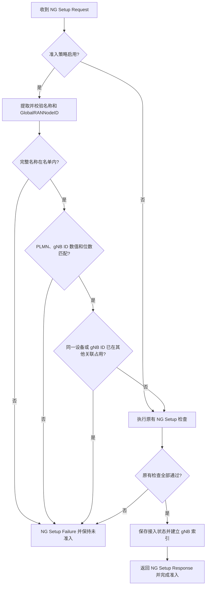

# 基于 RANNodeName 的基站准入方案与开发设计

版本：1.0；日期：2026-10-09；适用对象：本仓库 Open5GS AMF、xcn Chart、自研或 OAI 衍生 gNB。

本文保留固定名称方案作为比较参考。当前首版开发目标已升级为[独立设备密钥、时间戳、随机数、HMAC 与防重放缓存方案](gnb-ran-node-name-hmac-admission-design.md)。固定名称不能防抓包复制；新方案仍复用 RANNodeName，但需要两端动态认证逻辑。

本文中的旧方案为：基站通过现有 NGAP `RANNodeName` 上报固定设备标识，AMF 根据本地设备名单决定是否接受 NG Setup。交付范围是设计文档，不修改核心网实现或部署。本文的 AMF 配置项尚未实现；仅修改基站名称不会使当前 AMF 自动启用校验。

建议采用“每台设备一个完整名称，名单精确匹配，同时绑定 PLMN 和 gNB ID”。它能拦截未配置正确标识的基站，但名称可从配置或未加密信令中复制，不能证明硬件或厂家身份。如果以后需要防复制，可参考[证书与 IPsec 方案](gnb-access-control-design.md)。

## 1. 实现边界与现有代码

首版只控制 gNB 到 AMF 的 N2 接入。AMF 拒绝 NG Setup 后，不允许该连接继续处理 UE 接入信令；原有 UE 认证、TAI、切片检查仍须通过。这个判断不能保护直接访问 UPF 的 N3 流量，也不能阻止拥有核心网源码或管理权限的人删除校验。

现有代码已经具备报文字段和失败响应，不需要新增私有 IE 或重新生成 ASN.1：

| 位置 | 当前行为 | 后续设计 |
|---|---|---|
| `lib/asn1c/ngap/NGAP_ProtocolIE-ID.h` | 已定义 `RANNodeName`，IE ID 为 82 | 直接使用现有定义 |
| `lib/asn1c/ngap/NGAP_RANNodeName.h` | 类型为 `PrintableString_t` | 按字节长度处理，不假定有字符串结束符 |
| `src/amf/ngap-handler.c` 的 `ngap_handle_ng_setup_request()` | 不读取名称，检查 PLMN、TAI、切片后接受 NG Setup | 增加名称与设备名单检查 |
| 同文件的 `ngap_handle_ran_configuration_update()` | 不读取名称，可能修改 gNB ID | 增加已准入设备的身份一致性检查 |
| `src/amf/ngap-sm.c` | 未完成 NG Setup 时，拦截其他 NGAP 过程 | 复用现有门控 |
| 邻近 OAI 仓库的 `openair3/NGAP/ngap_gNB.c` | 将 `gNB_name` 编码进 NG Setup 的 `RANNodeName` | 基站侧通常只需配置名称 |
| OAI Chart 的 `config.gnbName` | 渲染为基站配置里的 `gNB_name` | 为每台基站配置不同完整名称 |

标准中的名称字段是可选字段，用于人类可读名称，基础长度约束为 1～150 字符且可扩展，IE 的 `criticality` 为 `ignore`。本方案是在 AMF 上增加私有准入策略：启用策略时要求基站提供符合约定的名称，保持现有 ASN.1 和发送侧 `criticality` 不变。[依据：3GPP TS 38.413 §8.7.1、§9.2.6.1 和 ASN.1 定义](https://www.etsi.org/deliver/etsi_TS/138400_138499/138413/18.07.00_60/ts_138413v180700p.pdf)。

## 2. 名称格式：每台设备一个固定值

建议格式：

```text
XCN-V1-GNB000001-00112233445566778899AABBCCDDEEFF
│   │  │         └─ 每台设备独立随机标记：32 个大写十六进制字符
│   │  └─────────── 设备编号：GNB + 6 位十进制数字
│   └────────────── 名称格式版本，升级基站软件时不自动改变
└────────────────── 产品标识，可替换成你自己的固定品牌缩写
```

本文固定 `XCN` 前缀，因此 V1 长度恰好为 49 字节，允许格式为：

```text
^XCN-V1-GNB[0-9]{6}-[0-9A-F]{32}$
```

若换用其他品牌缩写，应同时更新固定长度和两端约定。V1 的具体规则：

- 区分大小写，只允许上述 ASCII 字符，不去空格，不做大小写归一化。
- AMF 比较整个名称，包括设备编号和随机标记；只检查 `XCN-` 前缀不足以限制设备。
- 设备编号在管理名单内唯一；名称在设备出厂或登记时生成一次，重启和普通软件升级后保持不变。
- 随机标记用于降低猜中的概率，不是密码、签名或密钥，不能防止复制冒用。
- 文中的 `001122...` 是示例，正式设备必须单独随机生成，不共用示例值。

Ubuntu 可直接生成名称：

```bash
RAN_NODE_TAG="$(openssl rand -hex 16 | tr '[:lower:]' '[:upper:]')"
RAN_NODE_NAME="XCN-V1-GNB000001-${RAN_NODE_TAG}"
printf '%s\n' "$RAN_NODE_NAME"
```

把生成结果保存到该设备的基站配置和对应 AMF 名单中。不要把上面的随机生成命令放进每次启动的脚本，否则设备每次重启都会改变身份。

如果希望最初更简单，也可省略随机部分，使用固定设备编号；但精确匹配、更新检查和失败时禁止接入的规则仍然要保留。本文后续以带随机标记的 V1 为实施规格。

## 3. AMF 设备名单及启动行为

设备名单就是“允许接入本 AMF 的完整名称及绑定参数列表”，可先存放在 AMF YAML 中。首版不引入数据库、管理服务或证书体系。

拟新增配置示例，**当前程序尚不支持此字段**：

```yaml
amf:
  ran_node_name_admission:
    enabled: true
    devices:
      - ran_node_name: "XCN-V1-GNB000001-00112233445566778899AABBCCDDEEFF"
        plmn_id:
          mcc: "460"
          mnc: "11"
        gnb_id_bits: 28
        gnb_id: "0x1001"
      - ran_node_name: "XCN-V1-GNB000002-FFEEDDCCBBAA99887766554433221100"
        plmn_id:
          mcc: "460"
          mnc: "11"
        gnb_id_bits: 28
        gnb_id: "0x1002"
```

这里的 `plmn_id` 是 `GlobalRANNodeID` 中的归属 PLMN；不是将基站广播的全部 PLMN 都限制为一个。支持的 TA 和广播 PLMN 仍由现有检查负责。`gnb_id` 对应 NGAP 中的 gNB ID，不是 NR Cell ID；OAI 当前发送方式使用 28 位，数值和位数都应匹配。

启动时完成配置解析和校验，将名单转换为固定上限的内存表。建议首版上限为 256 项；超过上限直接报错，不能静默截断。少量设备用线性匹配足够，不必为此引入新数据库。

| 配置情况 | 启动及运行规则 |
|---|---|
| 未配置准入字段，或 `enabled: false` | 兼容旧行为；产品出厂配置应显式启用 |
| `enabled: true`，名单为空或缺失 | 可以启动，但拒绝所有基站，并记录明确告警 |
| 名称格式错误、重复名称或重复设备编号 | 启动失败，提示配置位置 |
| MCC/MNC、gNB ID 位数或数值错误 | 启动失败，不退回“关闭校验” |
| 参数类型错误、无法解析、名单超过上限 | 启动失败，不忽略错误项 |

MCC 必须是 3 位数字，MNC 必须是 2 或 3 位数字，保存其长度；例如 `01` 与 `001` 不能视为同一 MNC。PLMN 使用现有编码函数转为协议字节后比较，不用文本拼接或只比较整数 MNC。

gNB ID 合法位数为 22～32；数值须落在该位数表示范围内，解析时检查溢出和尾随字符。计算上限使用足够宽的无符号类型，避免执行 `1U << 32`。校验报文 BIT STRING 的缓冲区、有效位数和填充位后，再使用现有转换函数获取数值。

**本仓库现有 gNB 索引按数值 gNB ID 建立，不包含 PLMN。** 为保持最小修改，V1 名单内数值 gNB ID 也必须全局唯一，即使 PLMN 不同也不能复用同一个数值。跨 PLMN 重复数值、多条 SCTP 关联和完整多 TNLA 支持，留给后续独立设计。

## 4. NG Setup 的校验流程



### 4.1 提取报文中的名称

在 `ngap_handle_ng_setup_request()` 的 IE 遍历中记录名称数量，而不是遇到最后一个名称就覆盖前一个：

1. 必须恰好包含一个 `RANNodeName` IE；缺失、重复均拒绝，重复且值相同也拒绝。
2. 校验 IE 的 `value.present` 与该字段一致，结构和缓冲区有效。
3. V1 要求字节长度为 49，并逐字节校验约定格式；拒绝空值、嵌入 NUL、空格、额外后缀及不合规字符。
4. 比较完整字节串与配置表中的完整名称，不接受前缀、子串或截断匹配。
5. 对参与身份判断的 `GlobalRANNodeID` 同样检查缺失、重复和类型；V1 只接受合法 `globalGNB-ID` 分支，不能直接把其他联合体分支解释成 gNB。

还要处理现有 `Extended RAN Node Name` IE，不能无条件忽略它后仍按基础名称放行。标准规定扩展名称存在时应忽略基础名称。V1 不支持扩展名称准入：启用策略时，只要报文携带该字段，就以“不支持当前准入配置”拒绝本次 Setup；以后要支持时再统一定义两种字段的匹配规则。[依据：3GPP TS 38.413 §8.7.1](https://www.etsi.org/deliver/etsi_TS/138400_138499/138413/18.07.00_60/ts_138413v180700p.pdf#page=97)。

这属于自有产品的准入限制，可能拒绝其他合规 NGAP 实现；不能宣称启用该私有策略后仍接受所有标准基站。

### 4.2 与名单及现有检查组合

推荐执行顺序：

```text
校验报文结构及字段唯一性
  → 校验完整名称格式
  → 精确查找设备名单
  → 校验 GlobalRANNodeID 的 PLMN、gNB ID 数值及位数
  → 检查其他 SCTP 关联的身份和 gNB ID 占用
  → 执行现有容量、PLMN、TAI、切片等检查
  → 提交已准入状态和索引
  → 返回成功响应
```

将本次请求的身份保存在局部候选变量中，在授权检查通过前不要调用 `amf_gnb_set_gnb_id()`，也不要覆盖已准入名称。本仓库该函数会写入共享 gNB ID 索引，过早写入会让失败请求影响其他设备。

新连接必须从 `ng_setup_success = false` 开始，只有全部检查成功才进入已准入状态。若成功响应发送失败，要通过现有断链与上下文回收路径退出，不留下可继续接入的关联。可以沿用当前同步发送接口的顺序，但失败路径必须撤销准入；不能只记录错误后继续运行。

### 4.3 失败响应和日志

复用 `ngap_send_ng_setup_failure()`，不新增私有错误码：

| 拒绝原因 | 建议标准 Cause | AMF 本地原因 |
|---|---|---|
| 名称缺失、名单未命中、绑定参数不符、扩展名称不受支持、设备已占用 | `misc / unspecified` | 分别记录 `name_missing`、`name_not_allowed`、`identity_mismatch`、`extended_name_unsupported`、`device_in_use` |
| 重复身份 IE、错误类型、非法长度或字符、非法 BIT STRING | `protocol / semantic_error` | `malformed_identity` |
| 原有 PLMN、TAI、切片等检查失败 | 原有标准 Cause | 保留原有详细日志 |

避免向未授权对端反馈具体名单内容。日志记录关联标识、来源 IP、内部原因、可安全显示的设备编号；不必每次输出完整随机标记。未验证的报文字符串不能直接用 `%s` 打印，原始长度也不能直接转成无限制的日志长度。

配置中为产品设置有限的 `global.max.peer` 等容量参数；未通过检查的连接和反复失败连接不能无限占用上下文。失败响应完成后关闭未准入关联，按已有资源释放路径回收；发送失败同样需要回收。需要结合当前 SCTP 发送机制确认响应能先发出，不能先销毁套接字再发送。

## 5. 接入后的处理规则

### 5.1 同名或相同 gNB ID 的第二条连接

V1 约定每台设备最多使用一条活动 SCTP 关联。新关联若试图使用已有设备的名称或 gNB ID，应拒绝新关联，保留原来的连接及其 UE，不通过覆盖索引“踢掉”旧连接。

占用检查应包含仍在关闭或释放中的关联，不能只查一个布尔成功状态。只有旧上下文实际退出、索引与资源释放后，才能接受替代连接。断链后的短暂重试失败是可接受的，基站应等待后重连。

该策略能防止简单的重复连接替换，但合法设备离线后，复制了完整身份参数的另一台设备仍然可能接入。先接入成功的设备也不一定是正版硬件。

### 5.2 RAN Configuration Update

NG Setup 成功后，在 `ngap_handle_ran_configuration_update()` 中使用以下规则：

| 请求内容 | 处理 |
|---|---|
| 未携带名称 | 沿用已保存名称，不因缺少名称拒绝正常更新 |
| 携带唯一、合法且与已保存值完全相同的名称 | 继续检查其他更新字段 |
| 携带不同名称，即使新名称也在名单内 | 拒绝，V1 不允许关联在线切换设备身份 |
| 携带 GlobalRANNodeID | 校验类型、PLMN、gNB ID 数值与位数，必须与该关联的已批准身份一致 |
| GlobalRANNodeID 缺失 | 沿用原身份 |
| 重复身份 IE、非法名称、扩展名称 | 拒绝本次更新 |

标准规定配置更新中未出现的参数应保留原值，因此不能把“每次更新都必须带名称”作为要求。[依据：3GPP TS 38.413 §8.7.2](https://www.etsi.org/deliver/etsi_TS/138400_138499/138413/18.07.00_60/ts_138413v180700p.pdf#page=99)。

失败时使用现有 `ngap_send_ran_configuration_update_failure()`，保持原来准入状态和配置。身份校验必须在该函数现有的 `amf_gnb_set_gnb_id()` 和 TA 参数修改之前完成；其他需要变更的参数先校验再提交，避免“返回失败，但一部分状态已经被修改”。正常 TA、DRX 更新仍按原有规则处理。

### 5.3 同一关联重复 NG Setup

这是完整建链请求，与配置更新不同，不能在第二次请求失败时继续依赖第一次的成功标记。

为缩小首版改动，启用 V1 策略时约定：已准入关联再次发送 NG Setup，AMF 拒绝并有序关闭该关联，先停止接受新的 UE 信令，再通过现有生命周期释放其 UE 及 gNB 上下文；基站重新建立 SCTP 后完整校验。应将该重连要求写入自有基站的适配规格。它会中断该基站上的业务，联调必须验证基站能自动恢复。

不能只发送 NG Setup Failure 后返回并保留 `ng_setup_success = true`；也不能只将它置为 false 却永久留下旧 UE。若以后需要同关联完整重初始化，应单独实现符合 NG Setup 生命周期的清理及重建流程。

### 5.4 名单变更和设备停用

首版在 AMF 启动时加载静态名单，不承诺热更新。新增设备时配置两端并计划重启 AMF；停用设备时删除对应名单项并重启 AMF，使现有连接退出，重连时被拒绝。仅修改文件而不重启，不能立即撤销已经准入的连接。

AMF 重启可能影响该实例服务的其他 UE，按正常维护流程执行；如果要求不停服停用设备，再增加配置热加载、关联撤销和业务释放能力。

基站更换、编号或标记轮换时，在维护窗口更新对应名称和绑定参数，不允许同一设备编号的两项长期同时有效。旧记录删除后才完成停用，不能只在基站侧换名称。

## 6. C 实现注意事项及建议数据结构

可在 AMF 全局上下文中加入固定上限的名单表，每项保存完整名称、名称长度、编码后的 PLMN、gNB ID 数值与位数；在 `amf_gnb_t` 中保存已批准的名称、长度和 ID 位数。PLMN 和 gNB ID 可复用现有成员。首版不保存指向 YAML 节点或 ASN.1 缓冲区的指针。

建议名称缓冲区采用 `char ran_node_name[151]`，复制前确认产品格式与长度，复制后手工添加 NUL。ASN.1 消息释放后，其 `buf` 不能继续引用。匹配逻辑示意如下，仅表示安全的完整字节比较，不代表完整准入实现：

```c
#include <stdbool.h>
#include <stddef.h>
#include <stdint.h>
#include <string.h>

static bool ran_name_equal(const uint8_t *buf, size_t size,
        const char *expected, size_t expected_size)
{
    if (!buf || !expected || size == 0 || size > 150 ||
            size != expected_size)
        return false;

    /* expected_size 来自启动时已校验的配置项。 */
    return memcmp(buf, expected, size) == 0;
}
```

实际调用前还须检查 V1 长度和字符格式。不能直接对报文 `buf` 调用 `strlen()`、`strcmp()`，也不能在未校验长度时复制到固定数组。名称不是密钥，普通 `memcmp()` 足够；改用恒定时间比较不会让可复制的明文名称获得认证能力。

保留 AMF 现有事件处理模型，名单只在启动时解析，报文处理只做内存查询，不在 NGAP 路径访问文件、调用外部 HTTP 或执行 shell。占用检查与状态提交必须在同一串行事件处理路径执行；若以后引入多线程或热更新，则需为“检查占用并登记”整体提供同步和稳定配置快照。

回收时确认索引仍属于当前上下文后再删除，避免旧连接清理时移除其他设备的新索引。异步关闭期间用现有稳定上下文标识和关闭状态管理，不保留可被复用的裸指针。错误输入走失败路径，不用断言终止 AMF。

涉及已经建立业务的关联时，复用 `amf-sm.c` 中断链处理的 UE 去激活和 gNB 回收职责。关闭应通过现有事件及生命周期路径进行，不能在 NGAP 回调中随意释放调用栈仍可能引用的 `gnb`。

本方案复用现有 N2 路由和 SCTP 接口，不引入隧道、额外网卡或 N3 地址变化。源 IP 可以记录和用于现有网络访问控制，但不要把它当作上述名单检查的替代身份。

## 7. 后续最小修改范围

以下是后续实现时的文件范围，本文没有修改这些文件：

| 文件 | 拟修改内容 |
|---|---|
| `src/amf/context.h` | 名单结构、容量限制、gNB 已准入名称和 ID 位数 |
| `src/amf/context.c` | 配置解析与启动校验，名单查询、占用和生命周期处理 |
| `src/amf/ngap-handler.c` | NG Setup 名称校验、RAN Configuration Update 身份检查、重复 Setup 处理 |
| `configs/open5gs/amf.yaml.in` | 新配置项的说明和关闭默认值 |
| `helm/xcn/values.yaml` | 拟新增 `fivegc.ranNodeNameAdmission` 开关和设备列表 |
| `helm/xcn/templates/config.yaml` | 将 Chart 参数渲染进 AMF YAML |

若现有路径不能直接完成策略拒绝后的有序断链，应针对性调整 `src/amf/amf-sm.c` 或 `src/amf/ngap-path.c`，复用发送、关闭和 UE 释放机制。

优先在现有 AMF 文件内实现小型校验辅助函数，两个 NGAP 过程复用基础校验，不新增复杂授权模块。`ngap-sm.c` 的未准入门控通常可以直接复用；若生命周期实现必须调整状态机，再针对性修改。`lib/asn1c/ngap/` 不需要修改；OAI 已有名称发送代码一般也不需要修改。

开发顺序建议为：配置解析和报错 → NG Setup 校验 → 占用与断链处理 → 配置更新及重复 Setup 检查 → Chart 配置输出 → 联调和验收。只有完整走通这些路径后，产品配置才能打开新开关。

## 8. 基站侧配置及渲染示例

OAI 当前字段映射如下：

```yaml
config:
  activeGnb: "XCN-V1-GNB000001-00112233445566778899AABBCCDDEEFF"
  gnbId: "0x1001"
  gnbName: "XCN-V1-GNB000001-00112233445566778899AABBCCDDEEFF"
plmn:
  mcc: "460"
  mnc: "11"
  mncLength: 2
```

`config.activeGnb` 和 `config.gnbName` 必须同时设置为相同名称，分别对应 OAI 的 `Active_gNBs` 与 `gNB_name`；当前 OAI 配置代码会检查二者一致，不一致可能导致启动失败。PLMN、ID 和名称与 AMF 名单保持一致。

若为自己的基站代码，在 NG Setup Request 中加入现有 IE：`id_RANNodeName`，正确设置对应 `value.present`，使用有效字节长度编码，`criticality = ignore`。直接沿用已有 ASN.1 编码 API，不手工拼 PER 字节。

在当前工作区，以下命令只渲染基站清单，不安装或改动运行中的基站。先执行第 2 节的名称生成命令，再执行：

```bash
helm template gnb /home/xiazhangtao/code/openairinterface5g/charts/oai-gnb \
  --set-string config.activeGnb="$RAN_NODE_NAME" \
  --set-string config.gnbName="$RAN_NODE_NAME" \
  --set-string config.gnbId=0x1001 \
  --set-string plmn.mcc=460 \
  --set-string plmn.mnc=11 \
  --set plmn.mncLength=2 \
  > /tmp/oai-gnb-ran-name.rendered.yaml
rg -n -A 1 'Active_gNBs:|gNB_name|gNB_ID|mcc:|mnc:|mnc_length:' /tmp/oai-gnb-ran-name.rendered.yaml
```

部署时应将完整名称写入该台设备自己的 values 文件，避免多台设备共用一份名称配置。本方案不需要改变已有 AMF IP、N2/N3 网络地址、端口或基站接口状态。名称正确只是新增准入条件，网络可达和原有业务配置仍须正确。

## 9. 后续功能验收矩阵

下列检查必须在 AMF 功能实现后执行，不属于本文已完成的功能验证：

| 场景 | 预期 |
|---|---|
| 名称、PLMN、ID 数值及位数正确，原有配置正常 | NG Setup 成功，UE 能注册并建立数据业务 |
| 缺失名称、空名称、错误标记、只有合法前缀 | Setup 失败；后续 Initial UE Message 不进入业务处理 |
| 名称大小写改变、前后空格、截断、额外后缀、嵌入 NUL | 拒绝且 AMF 不崩溃、不越界 |
| 超长或扩展编码的名称、非法字符、异常缓冲区 | 拒绝或在解码层安全失败；资源正常释放 |
| 两个名称 IE、重复 GlobalRANNodeID、错误类型 | 拒绝，不能使用“最后一个值”放行 |
| 基础名称正确但包含扩展名称 | V1 拒绝，不能忽略优先级后放行 |
| 名称在名单内，但 PLMN、MNC 长度、ID 或位数不符 | 拒绝 |
| 第二关联使用同名或相同 gNB ID | 拒绝第二关联；第一关联和其 UE 不受替换影响 |
| 旧关联仍在释放，新关联尝试占用 | 暂时拒绝；释放结束后可重连 |
| 已成功关联再次 Setup，第二请求参数错误或正确 | 按 V1 重连规则退出，不能保留陈旧准入状态；UE 资源完成释放 |
| 更新不带名称，正常修改 DRX/TA 参数 | 沿用身份，按现有检查接受合法更新 |
| 更新改变名称、PLMN、ID 或位数 | 更新失败，原身份、索引和配置不被部分修改 |
| SCTP 断开后重连 | 重新查名单，不能沿用旧连接的成功状态 |
| 名单配置错误、重复或超过上限 | AMF 启动失败；不退回无校验模式 |
| 启用且名单为空 | AMF 启动但所有设备被拒绝 |
| 停用设备后重启 AMF | 旧关联退出，设备重连被拒绝 |
| 成功/失败响应发送失败，反复连接与异常断链 | AMF 正常运行，套接字、gNB/UE 上下文和索引无泄漏 |
| 两台不同合法设备并发连接和断开 | 正常业务与清理互不影响，无索引误删 |
| 未启用开关 | 既有合法基站和 UE 流程保持兼容 |
| 合法设备离线后，其他设备复制全部名称及绑定参数 | 可能被接受，这是方案的已知能力边界 |

建议联调抓取 N2 信令确认基站确实发送目标名称，再看 AMF 拒绝原因和 UE 行为。只看到配置文件中的名称，不能代替验证 NGAP 报文与 AMF 实际判断。

## 10. 本次文档验证范围

本次核对了现有 AMF 的两个处理入口、NG Setup 门控、gNB ID 索引，以及 OAI 名称发送和 Chart 字段映射。实际验证名称生成及格式、配置示例解析、上述名称比较示例的边界行为、OAI Helm 渲染结果和文档相对链接。

C 比较示例以严格编译告警、AddressSanitizer 和 UndefinedBehaviorSanitizer 运行，验证了不带 NUL 结束符的正常输入及 8 类拒绝输入。沙箱的跟踪机制不支持 LeakSanitizer，本次关闭了该检测器；示例不包含动态内存分配。未用这些检查推断完整 AMF 生命周期不存在泄漏。

没有实现或运行新增 AMF 准入功能，没有部署、重启核心网或基站，也没有把本节的文档与示例检查作为第 9 节的功能验收结果。
