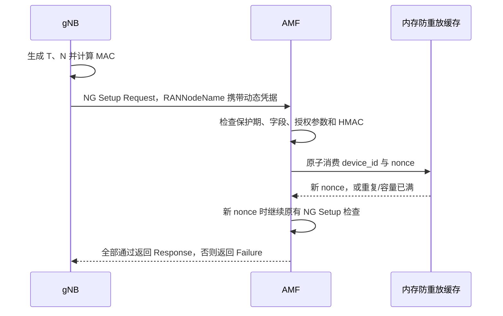

# RANNodeName 动态 HMAC 基站准入开发设计

版本：2.0；日期：2026-10-09；适用对象：本仓库 Open5GS AMF、xcn Chart、自研或 OAI 衍生 gNB。

当前选定方案为“每台基站独立密钥 + 时间戳 + 随机数 + HMAC-SHA256 + AMF 防重放缓存”，通过现有 NGAP `RANNodeName` 携带动态凭据。本文规定首版协议、配置、代码修改范围和验收条件，尚未实现核心网或基站功能，也不执行现网部署。

此方案取代[固定名称精确匹配方案](gnb-ran-node-name-admission-design.md)作为首版开发目标。不要同时开启两种准入方式，也不要在 HMAC 验证失败后退回固定名称放行。需要认证通道和 N2/N3 完整性保护时，参考[证书与 IPsec 方案](gnb-access-control-design.md)。

## 1. 能力及首版范围

目标：在设备密钥没有泄露、核心网程序和配置可信、双方时间正确的前提下，攻击者不能仅凭已成功使用的抓包记录伪造下一次基站接入。

| 问题 | 本方案的效果 |
|---|---|
| 修改设备编号、时间戳、随机数或绑定身份 | HMAC 不匹配，拒绝 |
| 复制已使用的完整凭据 | 命中防重放缓存，拒绝 |
| 保存抓包后很久再使用 | 超出时间窗口，拒绝 |
| AMF 重启丢失缓存后重放刚抓到的凭据 | 用启动保护期覆盖原凭据窗口 |
| 同名第二条连接替换合法基站 | 拒绝新关联，保留旧关联 |
| 截获尚未到达 AMF 的有效请求并抢先提交 | 仍存在首次使用抢占风险 |
| 实时转发合法设备的认证流程 | 不能独立防止实时中继 |
| 提取设备上的软件密钥 | 可以冒用该设备，需要硬件密钥保护来改善 |
| 伪造 AMF 的成功响应 | 本方案未实现基站对 AMF 的双向认证 |
| 接入后的 NGAP/GTP-U 流量被篡改 | 本次接入 HMAC 不提供整条连接的保护 |

首版限定：单 AMF 实例，每台设备一条活动 SCTP 关联；256 台登记设备上限；静态配置，重启生效；仅认证 NG Setup 中的设备身份参数。N2 网络地址、SCTP、N3 路由和接口配置保持现有方式。

HMAC 的定义依据 [RFC 2104](https://www.rfc-editor.org/rfc/rfc2104.html)。时间戳、nonce 唯一性及签名覆盖范围的防重放思路可参考 [RFC 9421 §7.2.2](https://www.rfc-editor.org/rfc/rfc9421.html#section-7.2.2)；后者属于 HTTP 标准，本文只借鉴安全机制，不将其作为 NGAP 标准功能。

## 2. 两端需要保存什么

| 数据 | 基站 | AMF | 在 NGAP 中传输 |
|---|---|---|---|
| `device_id`，如 `GNB000001` | 固定配置 | 授权名单索引 | 是 |
| `core_id`，如 `XCN-AMF-0001` | 目标认证域配置 | 本实例认证域配置 | 不单独传输，两端本地值纳入 HMAC |
| `key_id`，如 `K01` | 当前密钥版本 | 允许的密钥版本列表 | 是 |
| `K`，32 字节随机密钥 | 受控密钥文件 | 对应设备的密钥文件 | 否 |
| PLMN、gNB ID 及位数 | 现有基站配置 | 授权绑定参数 | 使用现有 GlobalRANNodeID |
| 时间戳、nonce、MAC | 每次 NG Setup 生成 | 从报文解析和验证 | 是，编码到 RANNodeName |
| 已使用 nonce | 不需要长期保存 | 全局防重放缓存 | 否 |

设备编号、密钥编号、nonce 和 MAC 都不是需要隐藏的密钥。每台设备必须有独立 `K`，禁止所有设备共用产品级固定密钥。`core_id` 不是源 IP，应稳定且区分不同认证实例，不随进程重启改变。

## 3. RANNodeName 的精确编码

### 3.1 固定 127 字节格式

```text
XCN2-GNB000001-K01-1800000000-000102030405060708090A0B0C0D0E0F-<64位大写十六进制MAC>
```

尖括号是说明用占位符，不出现在实际报文中。正式格式：

```text
^XCN2-GNB[0-9]{6}-K[0-9A-F]{2}-[0-9]{10}-[0-9A-F]{32}-[0-9A-F]{64}$
```

| 字段 | 长度 | 0 起始字节偏移 | 规则 |
|---|---:|---|---|
| `XCN2` | 4 | 0～3 | 固定协议版本 |
| 设备编号 | 9 | 5～13 | `GNB` 加 6 位十进制数字 |
| 密钥编号 | 3 | 15～17 | `K` 加 2 位十六进制；`K00` 保留，不允许 |
| 时间戳 | 10 | 19～28 | UTC Unix 秒，十进制，不使用本地时区字符串 |
| nonce | 32 | 30～61 | 16 字节安全随机数的大写十六进制 |
| MAC | 64 | 63～126 | 完整 32 字节 HMAC-SHA256 的大写十六进制 |
| 分隔符 | 各 1 | 4、14、18、29、62 | 必须为 `-` |

长度先检查为 127，再读取固定偏移。严格区分大小写，不去空格、不截断、不接受额外后缀。不允许嵌入 NUL。MAC 和 nonce 按二进制字节解码，不把十六进制文本直接作为密钥或随机数。

名称字段是 `PrintableString`，上述字母、数字和连字符符合其字符集；127 字节处于基础的 1～150 字符范围。标准名称用于人类可读显示，本文用途是双方私有约定，仍使用现有 IE ID 82 和 `criticality = ignore`，不修改 ASN.1。[依据：3GPP TS 38.413 §8.7.1、§9.2.6.1](https://www.etsi.org/deliver/etsi_TS/138400_138499/138413/18.07.00_60/ts_138413v180700p.pdf)。

启用 V2 时，缺少名称、重复名称、旧 V1 名称或未知版本均拒绝。携带 `Extended RAN Node Name` 的请求也拒绝，避免两种名称的解释优先级产生歧义；首版不支持扩展名称认证。

### 3.2 ASN.1 字符串的内存处理

报文 `buf` 不保证以 NUL 结束，不能调用 `strlen()` 或 `strcmp()`。检查 IE 类型、数量、`buf`、`size` 后按长度解析。需要保存在 gNB 上下文时复制到 `char setup_auth_name[128]`，第 127 字节手动写入 NUL，不保存指向解码消息的指针。

## 4. HMAC 输入：两端必须逐字节一致

不对含 MAC 的整个 RANNodeName 求 HMAC，不使用任意 JSON 序列化，也不直接发送 C 结构体内存。双方生成下列二进制字节串 `M`：

| 顺序 | 字段 | 编码及长度 |
|---:|---|---|
| 1 | 认证用途和协议版本 | ASCII `XCN-RAN-AUTH-V2` 加一个 NUL，总共 16 字节 |
| 2 | `core_id` 长度 | 1 字节无符号整数，合法范围 1～32 |
| 3 | `core_id` | 指定长度的 ASCII，仅 `[A-Z0-9-]` |
| 4 | `device_id` | 固定 9 字节 ASCII，不带 NUL |
| 5 | `key_id` | 1 字节，`K01` 对应 `0x01`，合法范围 1～255 |
| 6 | PLMN | NG Setup 的 GlobalRANNodeID 中原始 3 字节 PLMN 编码 |
| 7 | gNB ID 位数 | 1 字节，合法范围 22～32；当前 OAI 使用 28 |
| 8 | gNB ID 数值 | 4 字节无符号整数，大端序；使用解码后的实际数值 |
| 9 | 时间戳 | 8 字节无符号整数，大端序；由名称中的 10 位数字转换 |
| 10 | nonce | 16 字节原始随机数 |

```text
M 的长度 = 59 + core_id 字节长度，最大 91 字节
MAC = HMAC-SHA256(K, M)，输出全部 32 字节
```

PLMN `460/11` 的协议字节为 `64 F0 11`，三位 MNC 与两位 MNC 的协议编码不同。gNB ID 必须先验证 BIT STRING 缓冲区、有效位数和填充位，再转换数值；不能将网络缓冲区强转为 `uint32_t *`。时间戳使用 64 位解析，不能依赖 32 位 `time_t` 或 `atoi()`。

AMF 从实际 NG Setup 字段构造 PLMN 和 ID 部分，再与授权记录核对。不能只用名单里的参数求 HMAC，而忽略报文真实参数，否则绑定没有实际执行。

首版输入不覆盖 SupportedTAList、DRX、其他 NGAP 字段或后续消息；它们仍按现有业务规则检查，不能宣称整条 NGAP 消息已防篡改。后续若扩大签名覆盖范围，应另定义协议版本和规范化编码，或采用 IPsec。

## 5. 拟新增配置与启动校验

### 5.1 AMF 配置

以下字段均尚未实现：

```yaml
amf:
  ran_auth:
    enabled: true
    core_id: "XCN-AMF-0001"
    clock_skew_seconds: 30
    restart_guard_seconds: 90
    nonce_capacity_per_device: 128
    devices:
      - device_id: "GNB000001"
        enabled: true
        plmn_id:
          mcc: "460"
          mnc: "11"
        gnb_id_bits: 28
        gnb_id: "0x1001"
        keys:
          - key_id: "K01"
            key_file: "/run/secrets/xcn-ran/gnb000001.k01.key"
```

未设置或 `enabled: false` 时兼容旧行为；产品出厂显式启用。启用且设备表为空时拒绝所有基站。解析错误、非法值、重复身份或找不到密钥时启动失败，不能静默关闭认证。

启动校验：

- `core_id` 长度、字符集；设备编号格式、唯一性；最多 256 台设备。
- MCC 3 位数字、MNC 2/3 位数字，保留长度；gNB ID 位数和数值匹配。
- 本仓库现有 gNB ID 索引只按数值建表，因此首版设备表内数值 ID 全局唯一。
- 每台设备最多 2 个有效密钥版本，编号不重复；不同设备禁止共用同一密钥。
- 密钥文件是恰好 32 字节原始二进制，不是 64 字节十六进制文本；无法读取、长度不符即失败。只从受控本地目录加载，不跟随不可信路径。
- 首版 `clock_skew_seconds` 允许 1～30，默认 30；`restart_guard_seconds >= 2 × clock_skew_seconds + 5`，默认 90。
- `nonce_capacity_per_device` 允许 16～128，默认 128；超过上限报错，不自动扩大。
- 本地可信时钟已就绪；首版配置静态加载，密钥及授权变更需要重启。

### 5.2 基站配置

以下是拟新增到 OAI 单个 `gNBs` 配置项中的字段，现有配置解析器不会自动实现认证：

```yaml
Active_gNBs:
  - "gnb-rfsim"
gNBs:
  - gNB_name: "gnb-rfsim"
    gNB_ID: 0x1001
    ran_auth:
      enabled: true
      core_id: "XCN-AMF-0001"
      device_id: "GNB000001"
      key_id: "K01"
      key_file: "/run/secrets/xcn-ran/gnb000001.k01.key"
```

这是认证部分的配置片段，不是完整无线配置。PLMN、TAC、射频和 AMF 地址仍用现有配置。

`Active_gNBs` 与静态 `gNB_name` 保持相同。与固定名称方案不同，**动态凭据只替换本次 NG Setup 的 RANNodeName IE，不写回静态 gNB_name**。每次重试重新生成凭据，避免影响基站实例选择和显示名称。

首版只支持一个目标 AMF 和一个 `core_id`；多 AMF 配置在启用认证时应明确报不支持。后续支持时按目标 AMF 选择认证域，不能用一份凭据任意投递到多个实例。

## 6. 密钥生成、分发和轮换

Ubuntu 示例，只生成临时密钥文件，不安装或部署：

```bash
umask 077
RAN_AUTH_KEY_DIR="$(mktemp -d /tmp/xcn-ran-hmac.XXXXXX)"
openssl rand -out "$RAN_AUTH_KEY_DIR/gnb000001.k01.key" 32
chmod 600 "$RAN_AUTH_KEY_DIR/gnb000001.k01.key"
wc -c "$RAN_AUTH_KEY_DIR/gnb000001.k01.key"
```

正式交付时，在受控登记环境为每台设备独立生成，通过可信管理通道或受控离线流程分发给基站和 AMF。密钥不提交 Git、不写入镜像或 ConfigMap、不打印日志；容器部署使用已有外部 Secret 的只读文件挂载，访问权限与运行 UID 对齐。Kubernetes Secret 的存储及管理员访问权限仍需配置管理。

两端启动时读取密钥，NGAP 路径不反复访问文件。内存密钥按固定长度保存，减少不必要副本；退出及更换时使用不会被编译器消除的清零方法，调试转储和 ITTI 日志不能输出含密钥结构体。

轮换步骤：生成新的设备密钥 `K02` → AMF 加入 K02 并暂时保留 K01，重启 → 基站切换 K02 并重连 → 确认业务成功 → AMF 删除 K01 并重启。首版会经历实例启动保护期和业务恢复，应在维护窗口执行。

设备停用：将 `enabled` 设为 false 或删除设备记录，重启 AMF，现有连接退出后重连被拒绝。只改配置文件不会立即撤销内存中的授权。密钥泄露时应替换该设备密钥，不能仅更改名称前缀。

## 7. 基站发送流程

现有 OAI 入口是 `ngap_gNB_generate_ng_setup_request()`，当前直接将 `instance_p->gNB_name` 复制到名称 IE。后续改为：

1. 启动阶段校验配置、读取 32 字节密钥，并将认证配置传到 NGAP 实例。
2. 构造当前请求的 GlobalRANNodeID，获得实际 PLMN、gNB ID 数值与位数。
3. 读取 UTC Unix 秒 `T`；时钟未就绪或超出 10 位表示范围时不发请求。
4. 从系统 CSPRNG 读取完整 16 字节 `N`；每次新的应用层 NG Setup 尝试使用新 nonce。
5. 按第 4 节编码 `M`，计算 HMAC-SHA256，编码为严格 127 字节名称。
6. 用现有 ASN.1 API 写入 RANNodeName，保留 `criticality = ignore`，发送正常 NG Setup。
7. 失败后遵守 TimeToWait 和重连策略；重新取时间、nonce 和 MAC，不复用旧凭据。

传输层 SCTP 重传不重新生成应用消息；应用层重试才生成新凭据。成功响应丢失而需要新一轮 NG Setup 时，首版要求重新建 SCTP，使用新 nonce。

当前 OAI 的 `ngap_gNB_handle_ng_setup_failure()` 主要读取 Cause、切换等待状态和通知应用，没有解析 TimeToWait；不能假设首次 Setup 失败后现有重连流程一定会自动恢复。后续需针对性补充：解析标准 TimeToWait，安排一个重试定时器，等待结束后关闭/回收尚存的失败关联并重建 SCTP，然后生成全新的凭据。没有 TimeToWait 时也采用有下限的退避，不忙循环。

重试等待至少遵守对端 TimeToWait，可再加小幅随机抖动；同一个 AMF 同时只保留一个重连任务，Setup Failure 与断链通知不能重复安排。维护 pending/associated 计数的一致性，取消定时器后再释放其上下文，避免回调访问已释放对象。必须实际验证“基站比 AMF 先启动”和“AMF 重启后自动恢复”两种情况。

Ubuntu/Linux 可使用 `getrandom()`，循环处理 `EINTR`、短读和错误；或使用项目已采用的密码库安全随机接口并检查返回值。不能用 `rand()`、时间戳或 PID 充当随机数。任何取时间、随机数、MAC 或编码失败都停止该次请求，不能发送固定名称作为兜底。

## 8. AMF 校验与状态提交



在 `ngap_handle_ng_setup_request()` 前半部分读取候选身份，按顺序执行：

```text
未通过新认证的关联只允许 NG Setup
  → 检查启动/时钟保护状态
  → 提取 IE：恰好一个基础名称，恰好一个合法 GlobalRANNodeID
  → 校验名称 127 字节结构，解码 device_id、key_id、T、N、MAC
  → 查找启用设备和密钥版本，检查实际 PLMN、gNB ID 数值与位数
  → 读取 AMF 当前时间，验证时间窗口
  → 构造 M，重新计算 HMAC，恒定时间比较 32 字节 MAC
  → 原子检查并消费 nonce；不存在空闲项时拒绝
  → 检查其他活动/正在释放的关联是否占用相同设备或数值 ID
  → 执行原有容量、PLMN、TAI、切片等检查
  → 保存准入身份、建立 gNB 索引、完成成功响应
```

nonce 在 HMAC 和授权参数通过后消费，即使随后的原有业务检查或响应发送失败，也保留该 nonce 的消费记录。这确保已经验证过的凭据不会在断链或失败重试时变回可用；合法基站需按第 7 节生成新凭据。

候选参数放在局部结构，批准前不调用 `amf_gnb_set_gnb_id()`。完成全部检查前保持 `ng_setup_success = false`；成功响应发送失败时撤销准入并进入回收路径。不得留下有索引但未授权、或授权失败却成功标记仍为 true 的状态。

复用现有失败响应：结构错误用 `protocol / semantic_error`，认证失败用 `misc / unspecified`，保护期或容量不足可用 `misc / control_processing_overload`。不向对端返回密钥是否存在或完整授权表。本地日志区分格式、时钟、授权、MAC、重放和容量原因，但不输出密钥、完整凭据或未经校验的 `%s`。

失败响应按现有发送机制发出后，有序关闭并回收未准入关联，不能让反复失败的连接无限占用 gNB 上下文。发送失败同样进入清理路径；不能先销毁套接字再尝试发响应。全局已消费 nonce 不随此次清理删除。

## 9. 防重放缓存的具体规则

### 9.1 缓存归属、索引与容量

缓存属于 AMF 全局认证上下文，**不能放在单条 SCTP 连接里，也不能在 gNB 断开时删除**。

每台设备最多 128 项，首版用固定数组即可。记录包含：`nonce[16]`、签发时间 `T`、最早可回收的单调时钟时间及占用标记。查找键为 `(device_id, nonce)`，不把来源 IP、SCTP 关联、key_id 或时间戳放进键里，否则同一 nonce 可能因这些值不同再次通过。

单设备数组查重最多比较 128 项，避免引入数据库和复杂共享缓存。占用时使用设备稳定索引，配置不热更新，因此无需持有 YAML 指针。设备表和 nonce 数组都有固定上限，异常流量不能扩大内存。

### 9.2 时间窗口与回收条件

定义 `W = 30 秒`，接受条件为：

```text
T 不早于 AMF 当前时间减 W，且不晚于 AMF 当前时间加 W
```

C 实现应使用经边界校验的 64 位值和安全差值判断，不能让无符号减法下溢。时间戳来自不可信报文，先验证数字、范围和溢出。

若请求时间戳比 AMF 快 30 秒，它在首次接受后最多仍可满足时间检查约 60 秒。因此不能简单将缓存 TTL 设为 30 秒。

首次消费时记录 `retire_mono = 当前单调时间 + 2W + 5 秒`。正常运行时，只有以下两项都成立才回收：

```text
单调时钟已超过 retire_mono
并且当前 UTC 时间严格大于 T + W
```

这同时避免过早回收和用墙上时钟回拨来延长/重复接受旧凭据。固定时间 TTL 不能代替当前时间窗口检查。缓存已满时拒绝新凭据并告警，不能淘汰仍有效的旧记录以腾出空间；否则攻击者可重放被淘汰的记录。

### 9.3 原子消费与并发

首版复用 AMF 串行事件处理路径，把“查重 + 占用空闲项”作为一个不可交错操作。不能先查无重复，再在异步任务结束后写入。

若后续改成多线程，两步必须在同一锁或原子事务里执行。同设备的两个并发相同 nonce 只能有一个通过。错误 MAC 不写缓存；有效 MAC 高频请求至多填满该设备自己的额度，不挤出其他设备的有效记录。

### 9.4 AMF 重启与时钟异常

首版选择内存缓存，不落数据库，因此每次进程启动都进入默认 90 秒的新接入保护期。AMF 正常启动、监听及处理事件，不阻塞线程休眠；保护期间返回临时失败，基站按等待时间重试。应将保护状态纳入运维观察，不能把它当作进程死锁反复重启。

保护期从“可信 UTC 时间就绪”开始计时，单调时钟和 UTC 的前进时间都必须达到配置的保护时长，才能开放新认证。该时长必须超过旧请求的最大有效窗口 `2W`。重启后不能配置为 0 来加速接入。

通过周期检查和认证前检查比较 UTC 与单调时钟的推进量；检测到明显回拨或跳变（首版可设相差超过 1 秒）时，暂停新的认证、清理缓存并重新进入完整保护期。频繁异常时持续拒绝新接入并告警；已有已认证关联不因时间戳超过 30 秒自动断开。

可信、正确的时钟是此设计的前提。任意长期时钟错误或管理员操纵时间不在该保护期的保证范围内；若要求不依赖可信时间，应改为核心网随机挑战，或设计持久化防重放状态。

### 9.5 多 AMF

首版不支持多个 AMF 共享同一个认证域各自独立接受凭据。后续选择其一：每个实例拥有不同 `core_id`，基站为实际目标单独生成凭据；或共享认证域，并使用具有原子唯一性操作的共享防重放存储。仅部署多个独立内存缓存会让同一凭据在各实例分别通过。

## 10. 已准入连接、更新和释放

gNB 上下文保存批准的设备编号或稳定表索引、key_id、PLMN、gNB ID 数值与位数，以及首次认证名称副本。MAC 对应时间戳只用于本次建链，不是每 30 秒续期的会话租约。

| 情况 | 首版处理 |
|---|---|
| 未完成 NG Setup 的其他 NGAP 消息 | 复用 `ngap-sm.c` 的现有门控，不处理 UE 业务 |
| 新关联使用正在占用的设备或 gNB ID | 拒绝新关联，不覆盖旧索引；已消费 nonce 继续保留 |
| 合法关联断开后重连 | 新时间、新 nonce、新 MAC，重新完成所有检查 |
| 已准入关联再次发 NG Setup | 拒绝并有序关闭，清理 UE 与 gNB 上下文，重新建 SCTP |
| RAN Configuration Update 不带名称/身份 | 沿用已批准身份，正常检查 TA/DRX 等更新 |
| 更新携带 GlobalRANNodeID | 必须与批准的 PLMN、ID 数值及位数一致，禁止在线换身份 |
| 更新携带基础名称 | 首版只允许等于本关联首次认证名称；它不触发新的认证，不重新检查其旧时间戳 |
| 更新携带新的动态凭据、旧静态显示名、重复身份 IE 或扩展名称 | 拒绝更新，保持旧身份和配置 |
| 设备停用或密钥撤销 | 修改配置并重启 AMF；不宣称已有连接可仅靠文件改动立即撤销 |

建议基站正常更新不发送名称字段，以免把静态显示名误当认证名称。以后需要在线再认证时另定义独立过程，不能靠名称改变自动换身份。所有配置更新先检查候选参数再修改索引或 TA 列表。

占用判断涵盖正在关闭/释放的关联，旧上下文实际退出后才允许新关联登记。gNB 回收只释放关联及业务资源，不能清空全局 nonce 历史。删除索引前检查它仍属于本上下文，避免旧连接误删新索引。

有序关闭沿用现有 SCTP 发送与生命周期机制；已建立业务时复用 `amf-sm.c` 中 UE 去激活和 gNB 清理职责，避免 NGAP 回调直接释放调用栈仍引用的对象。

## 11. 后续代码实现范围与接口草案

本次不修改下列代码；它们是后续开发范围。

### 11.1 核心网

| 文件 | 拟修改 |
|---|---|
| 拟新增 `src/amf/ran-auth.h`、`ran-auth.c` | 严格凭据解析、规范编码、HMAC 验证、设备表、防重放缓存与保护期状态 |
| `src/amf/meson.build` | 将小型认证模块加入 AMF 构建 |
| `src/amf/context.c`、`context.h` | 配置解析入口、模块初始化/释放、gNB 已批准身份 |
| `src/amf/ngap-handler.c` | NG Setup 调用认证、配置更新身份检查、重复 Setup 处理 |
| 按需 `src/amf/amf-sm.c`、`ngap-path.c` | 有序失败关闭、业务释放、保护期维护事件 |
| `configs/open5gs/amf.yaml.in` | 新配置项文档和默认关闭配置 |
| `helm/xcn/values.yaml`、`templates/config.yaml` | 拟新增 `fivegc.ranAuth`，输出 AMF 配置及密钥路径 |
| `helm/xcn/templates/5gc.yaml` | 将外部 Secret 只读挂载到 AMF 所在容器，不将密钥渲染到 ConfigMap |

小模块独立存放认证逻辑，避免让已有较长的 NGAP handler 承担密码学、缓存和密钥文件管理；不重构其他网元或协议库。

可复用 `lib/crypt/ogs-sha2-hmac.c` 的 `ogs_hmac_sha256()`：key_size 固定 32，message_len 最大 91，mac_size 固定 32。该接口不替调用者验证输出长度，不能把 64 位十六进制文本长度当成 mac_size，否则会越界。

MAC 先解码为 32 字节再使用经过审查的恒定时间比较函数，不能直接 `strcmp()` 或普通提前结束的 `memcmp()`。可以使用已有密码库比较接口，或提供专门的固定长度辅助函数并检查编译结果。

接口草案，非现有函数：

```text
ran_auth_init(config) -> 验证配置、加载密钥、初始化缓存及保护期
ran_auth_parse_name(buf, size, credential) -> 严格解析 127 字节凭据
ran_auth_encode_input(core_id, identity, credential, out[91], out_len)
ran_auth_verify_and_consume(identity, credential, wall_now, mono_now)
    -> OK / FORMAT / UNAUTHORIZED / CLOCK / MAC / REPLAY / CAPACITY
ran_auth_check_update(approved_identity, candidate_update) -> 是否允许
ran_auth_final() -> 清理缓存和密钥
```

函数不自行发送 NGAP、不操作 gNB 索引、不修改成功标记。handler 根据结果继续原有业务判断，并在最后提交准入状态。外部输入错误走失败路径，不使用断言杀死 AMF。

### 11.2 OAI 或自研基站

| OAI 路径 | 拟修改 |
|---|---|
| `openair2/GNB_APP/gnb_config.c`、`gnb_paramdef.h` | 解析单 gNB 的 ran_auth 配置，校验并读取密钥 |
| `openair2/COMMON/ngap_messages_types.h` | 注册消息传递认证配置，明确定长内存和所有权 |
| `openair3/NGAP/ngap_gNB_defs.h` | NGAP 实例保存设备、认证域和当前密钥 |
| `openair3/NGAP/ngap_gNB.c` | 在 `ngap_gNB_generate_ng_setup_request()` 动态构造名称 |
| `openair3/NGAP/ngap_gNB_handlers.c`，按需相关定时器路径 | 解析 Setup Failure 的 TimeToWait，安排去重的等待重连并恢复计数 |
| 按需新增 NGAP 内小型辅助文件及其构建项 | 共用规范编码、安全随机数和 MAC 生成 |
| `charts/oai-gnb/values.yaml`、`templates/configmap.yaml`、部署模板 | 拟新增非秘密配置和外部 Secret 挂载 |

OAI 已有 `openair3/SECU/sha_256_hmac.c`，可参考其 OpenSSL HMAC-SHA256 实现和依赖。新发送路径必须检查库调用、随机数和编码的失败，不默认发送无认证请求。两端可以用不同密码库，但必须通过同一测试向量。

这次只读了 OAI 文件，不修改邻近仓库。两端均使用现有 ASN.1 RANNodeName 类型，不重新生成 NGAP 协议代码。

## 12. 双端联调的固定测试向量

以下密钥和 nonce 都是公开测试数据，禁止给正式设备使用。测试时间固定，不应直接用于真实时间窗口的认证。

```yaml
test_vector:
  core_id: "XCN-AMF-0001"
  device_id: "GNB000001"
  key_id: "K01"
  key_hex: "000102030405060708090A0B0C0D0E0F101112131415161718191A1B1C1D1E1F"
  plmn_hex: "64F011"
  gnb_id_bits: 28
  gnb_id: "0x1001"
  timestamp: 1800000000
  nonce_hex: "000102030405060708090A0B0C0D0E0F"
  input_bytes: 71
  input_hex: "58434E2D52414E2D415554482D5632000C58434E2D414D462D30303031474E423030303030310164F0111C00001001000000006B49D200000102030405060708090A0B0C0D0E0F"
  mac_hex: "1EF27850D50E7F8C1AD7B8858D13549987A6871C1EE22BB56F5BB89555705734"
  ran_node_name: "XCN2-GNB000001-K01-1800000000-000102030405060708090A0B0C0D0E0F-1EF27850D50E7F8C1AD7B8858D13549987A6871C1EE22BB56F5BB89555705734"
```

Ubuntu 上可使用 Python 标准库独立复算，不需要安装额外包；这是编码与 MAC 参考，不是生产 AMF 或基站实现：

```bash
python3 - <<'PY'
import hashlib
import hmac
import struct

key = bytes(range(32))
core = b"XCN-AMF-0001"
device = b"GNB000001"
nonce = bytes(range(16))
timestamp = 1800000000
message = (
    b"XCN-RAN-AUTH-V2\x00"
    + bytes([len(core)]) + core + device + bytes([1])
    + bytes.fromhex("64F011") + bytes([28])
    + struct.pack("!IQ", 0x1001, timestamp) + nonce
)
mac = hmac.new(key, message, hashlib.sha256).hexdigest().upper()
name = f"XCN2-{device.decode()}-K01-{timestamp:010d}-{nonce.hex().upper()}-{mac}"
assert len(message) == 71
assert mac == "1EF27850D50E7F8C1AD7B8858D13549987A6871C1EE22BB56F5BB89555705734"
assert len(name.encode("ascii")) == 127
print("input:", message.hex().upper())
print("MAC:", mac)
print("RANNodeName:", name)
PY
```

## 13. 验收矩阵与实施顺序

| 检查 | 预期 |
|---|---|
| 两端固定向量 | M、MAC 和名称逐字节相同 |
| 合法设备、新 nonce、正常时间及业务配置 | NG Setup 成功，UE 注册和数据业务正常 |
| 名称缺失、重复、旧版、未知版本、扩展名称、错误字符、NUL、超长 | 安全拒绝，不越界、不崩溃、不降级 |
| 错误密钥或 key_id；篡改 T、nonce、设备编号、core_id、PLMN、ID 数值/位数 | MAC 或授权判断失败 |
| 时间差在 ±W 边界，或超出边界 1 秒 | 按明确边界接受/拒绝；无整数溢出 |
| 同一凭据第二次使用，包括新 SCTP 或另一来源 IP | REPLAY；断链不删除缓存 |
| 时间戳领先 W，缓存经过 W 秒后重放 | 仍拒绝，不因错误 TTL 提前回收 |
| 更换时间戳或 key_id，复用已消费 nonce，并重新生成合法 MAC | 仍按同设备 nonce 唯一性拒绝 |
| 同时提交相同 nonce | 最多一个通过消费步骤 |
| 错误 MAC 高频请求 | 不占用 nonce 缓存 |
| 单设备缓存满或合法 MAC 高频请求 | 拒绝新请求，不淘汰有效记录，不挤占其他设备额度 |
| AMF 重启、时间回拨或跳变 | 进入保护期；不在旧窗口内重新接受旧凭据 |
| 基站先启动或 AMF 保护期内暂时拒绝 Setup | 遵守 TimeToWait，保护期结束后自动用新凭据重连成功 |
| 随机数短读、EINTR、失败，密钥读取或编码失败 | 正确重试/失败，不发送静态兜底名称 |
| 响应发送失败、SCTP 异常断链、重试 | 回收 gNB/UE/套接字，nonce 记录保留到安全回收 |
| 第二关联尝试占用同设备或数值 ID | 原关联和 UE 不被替换 |
| 配置更新尝试换身份、重复 Setup | 按第 10 节处理，失败不造成部分状态提交 |
| 未启用认证 | 原有基站、NGAP、UE 业务兼容 |
| 新增、停用、K01/K02 轮换及撤销 | 维护窗口内按配置生效，撤销后旧密钥不能新接入 |

开发按顺序进行：实现两端相同编码并跑固定向量 → 配置和密钥生命周期 → 基站动态发送 → AMF 验证及全局缓存 → 时间保护、占用和释放路径 → Chart Secret 挂载 → 两端及 UE 联调。不能只完成 MAC 比较就启用产品准入。

## 14. 本次验证范围

本次只核对代码入口和复用能力，验证文档配置、名称编码、固定向量、HMAC 互算和独立防重放模型。模型检查用于发现协议规则的问题，不是已实现的 AMF 认证功能或端到端验收。

实际检查：127 字节凭据的字段偏移及格式、两端配置绑定、32 字节密钥生成及 0600 权限、71 字节固定输入、9 类认证输入篡改，以及 59 项独立模型断言。模型覆盖时间窗口边界、已使用 nonce、密钥轮换、容量满时不淘汰、延迟回收、进程重启、时间回拨和并发重复消费。

固定向量由 Python 标准库、OpenSSL 命令行和现有 Open5GS SHA2/HMAC 源码的隔离编译互相核对。隔离构建仅提供最小类型头文件，不构建完整 AMF 或 OAI；现有库的有符号/无符号比较告警未作为该隔离构建的错误。C 运行使用 AddressSanitizer 和 UndefinedBehaviorSanitizer，因沙箱跟踪限制关闭 LeakSanitizer，不据此宣称完整连接生命周期没有泄漏。

没有修改 AMF、OAI、ASN.1 或 Chart 实现，没有部署、重启核心网或基站。第 13 节仍是后续开发验收要求。
